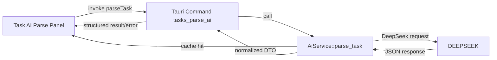

# Design Document: AI Integration Simplification

## Overview

We will refactor the AI task parsing stack to rely solely on DeepSeek as the provider, remove the local Chain-of-Thought fallback, and simplify the end-to-end user interaction to "input → parse → auto-fill". The change touches Rust backend services, Tauri commands, shared models, caches, and React UI components. The resulting architecture keeps the strengths of the current DeepSeek integration while eliminating redundant modules, confusing UI states, and inconsistent error flows. The end state is a leaner, more reliable, and more understandable AI experience that satisfies the newly approved requirements.

## Steering Document Alignment

### Technical Standards (tech.md)

- **Tauri + Rust service layer**: Keep AI communication inside Rust with `reqwest`, preserving existing async patterns and respecting the service/command separation defined in tech.md.
- **Security**: Continue using the encrypted API key storage defined in the existing `CryptoVault`, following privacy principles in product.md and tech.md.
- **Testing tools**: Extend the current `cargo test` and Playwright suites, aligning with the mandated automation stack (Vitest, Playwright, cargo test).

### Project Structure (structure.md)

- **Folder layout**: Modify files only inside the existing `src-tauri/src/services`, `src-tauri/src/commands`, `src/services/tauriApi.ts`, and `src/components/tasks` directories—consistent with structure.md organization.
- **State management**: Keep Zustand stores as the single source of truth for settings and AI status. Reuse `useSettingsStore` and `useTaskForm` hooks instead of introducing new global states.
- **UI components**: Update existing Task AI panel components under `src/components/tasks` instead of adding parallel variants, keeping the tree flat and cohesive.

## Code Reuse Analysis

### Existing Components to Leverage

- **`src-tauri/src/services/ai_service.rs`**: Preserve cache handling, configuration loading, and DeepSeek provider logic. Prune only the CoT fallback and provider multiplexing.
- **`CacheService`**: Continue using the existing cache abstraction for parse results, maintaining consistent TTL handling.
- **`CryptoVault` & `AiSettingsRepository`**: Reuse for secure API key storage and retrieval.
- **`useTaskForm` hook**: Keep the form wiring logic and extend its AI pipeline with simplified parse invocation and state transitions.
- **`useSettingsStore` & `useAI`**: Reuse the status fetching logic; adjust to reflect single-provider modes.

### Integration Points

- **DeepSeek HTTP API**: Continue calling `/v1/chat/completions`. Update payload construction (prompt template) but maintain HTTPS-only communication and structured JSON parsing.
- **SQLite schema**: No schema change; reuse `ai_cache` tables but ensure cleanup jobs drop references to removed provider metadata.
- **Tauri Command**: `tasks_parse_ai` remains the IPC entry point; adjust implementation to remove fallback metadata and expose normalized errors.

## Architecture

The AI pipeline collapses to a single provider path with normalized error reporting and simplified UI feedback.



### Modular Design Principles

- **Single File Responsibility**:
  - `ai_service.rs`: Only handles configuration refresh, cache checks, DeepSeek HTTP calls, and error normalization.
  - `prompt_templates.rs`: Owns prompt construction and ensures JSON-friendly instructions.
  - `useTaskForm.ts`: Manages AI parse state machine (idle/loading/success/error) and applies results to the form.
  - `TaskAiParsePanel.tsx`: Presents a minimal UI for input, parse button, success acknowledgement, and retry.
- **Component Isolation**: Remove `TaskCotViewer`, CoT feedback controls, and fallback badges to prevent cross-component dependency overhead.
- **Service Layer Separation**: Maintain strict boundaries—no UI logic leaks into Rust. Rust never formats user-facing strings; it returns error codes and metadata.
- **Utility Modularity**: Reuse existing utilities (e.g., `removeUndefinedDeep`) and add a small `mapDeepSeekError` helper instead of scattering error code strings.

## Components and Interfaces

### Backend: `AiService`

- **Purpose**: Provide a single DeepSeek-backed `parse_task`, create normalized `AppError`s, and interact with caches.
- **Interfaces**:
  - `pub async fn parse_task(&self, request: TaskParseRequest) -> AppResult<TaskParseResponse>`
  - Internal helpers: `invoke_deepseek_chat`, `build_provider_metadata`, `map_deepseek_error` (new), `refresh_configuration` (retained)
- **Dependencies**: `reqwest`, `CacheService`, `CryptoVault`, existing models.
- **Reuses**: Cache service, error types, configuration loader.

### Backend: `DeepSeekProvider`

- **Purpose**: Focus exclusively on HTTP call and response interpretation.
- **Interfaces**: `async fn parse_task(&self, request: &TaskParseRequest) -> AppResult<ParsedTaskDto>`
- **Changes**:
  - Remove `generate_recommendations`/`plan_schedule` usage if not referenced in this spec; they remain for other flows but no longer rely on fallback metadata.
  - Simplify `invoke_chat` to parse JSON directly (`Response::json`).
  - Add correlation IDs (UUIDv4) to each request for debugging.
- **Reuses**: Prompt templates, existing metadata injection helper.

### Tauri Command: `tasks_parse_ai_impl`

- **Purpose**: Forward the parse request to `AiService`, translate `AppError` into `CommandError` with new `code`s that the front end understands.
- **Dependencies**: `TaskParseRequest/Response`, `AppError`.
- **Changes**: Remove offline fallback messages from log output, include correlation ID in error details for debugging (but keep secret-free).

### Frontend: `parseTask` API wrapper (`src/services/tauriApi.ts`)

- **Purpose**: Validate payload via Zod, invoke Tauri command, map errors to typed `AppError`.
- **Changes**:
  - Update error code union to include `MISSING_API_KEY`, `HTTP_TIMEOUT`, `RATE_LIMITED`, `INVALID_RESPONSE`, `DEESEEK_UNAVAILABLE`.
  - Remove fallback-specific codes or messages.

### Frontend: `useTaskForm` hook

- **Purpose**: Manage form state and AI result application.
- **Interfaces**: `triggerAiParse`, `applyAiResult`, `clearAiState`.
- **Changes**:
  - Simplify `TaskFormAiState` to track `status`, `error`, `result`, `appliedFields`, `lastInput`.
  - Remove `strategy`, `source badges`, `onCotFeedback` wiring.
  - Add `correlationId` to AI state when errors occur to help debugging (optional display in dev builds).

### Frontend: `TaskAiParsePanel`

- **Purpose**: Provide minimal UI for entering text, running parse, and showing success/error.
- **Changes**:
  - Remove CoT viewer trigger, offline badges, and multiple buttons.
  - Replace with a single parse button, success toast/inline message, error card with retry.
  - Display DeepSeek key status (configured/not) using a small badge.
- **Dependencies**: `Button`, `Alert`, `Textarea`, icons.

### Frontend: Settings Page adjustments (`src/pages/Settings.tsx`)

- **Purpose**: Reflect single-provider status. Remove offline mode descriptions.
- **Changes**: Simplify status badges to `在线/未配置/不可用` and show the last check timestamp.

## Data Models

### Rust DTOs (`src-tauri/src/models/ai_types.rs`)

```
pub struct TaskParseResponse {
    pub payload: ParsedTaskPayload,
    pub missing_fields: Vec<String>,
    pub ai: TaskParseAiTelemetry,
}

pub struct TaskParseAiTelemetry {
    pub summary: Option<String>,
    pub next_action: Option<String>,
    pub confidence: Option<f64>,
    pub generated_at: Option<String>,
    pub provider: Option<AiProviderMetadata>, // now always "deepseek"
    pub metadata: Option<serde_json::Value>,  // include correlation_id, cache_hit flag
}
```

- Ensure `AiProviderMetadata` defaults to DeepSeek info without fallback hints.
- Add `correlation_id` (string) to metadata when responses originate from DeepSeek; for cache hits, include `cache_hit: true`.

### Frontend Types (`src/types/task.ts`, `src/types/settings.ts`)

- Adjust `TaskParseResponse['ai']['source']` union to remove `cache`/`offline` enumerations if unused.
- Extend `AppErrorCode` union to include new error identifiers.

## Error Handling

### Error Scenarios

1. **DeepSeek API Key Missing**
   - **Handling**: `AiService::parse_task` detects missing key after `refresh_configuration`, returns `AppError::validation("MISSING_API_KEY")`.
   - **User Impact**: Frontend shows "未检测到 DeepSeek API Key" with a button linking to Settings.

2. **Network Timeout / Connectivity Failure**
   - **Handling**: `invoke_chat` catches `reqwest::Error::is_timeout()` and returns `AppError::transient("HTTP_TIMEOUT")` with correlation ID.
   - **User Impact**: Frontend displays "网络连接超时" with a Retry button.

3. **Rate Limiting**
   - **Handling**: HTTP 429 mapped to `AppError::transient("RATE_LIMITED")` with retry-after hints.
   - **User Impact**: Inform the user to wait (optionally show recommended interval if header provided).

4. **Invalid Response Structure**
   - **Handling**: If DeepSeek returns unexpected JSON, map to `AppError::other("INVALID_RESPONSE")` and log sanitized snippet plus correlation ID.
   - **User Impact**: Show "AI 返回异常格式" with Retry and instructions to modify input if repeated.

5. **Cache Hit (not an error)**
   - **Handling**: Include metadata `cache_hit` but no user-facing change; maybe a subtle icon for dev mode debugging.
   - **User Impact**: Fast success message.

## Testing Strategy

### Unit Testing

- **Rust**:
  - `ai_service_tests.rs`: Add tests covering missing key, timeout mapping, invalid JSON error, and correlation ID propagation.
  - `prompt_templates.rs`: Validate new prompt string includes JSON example and instructions; ensure `build_task_parse_payload` matches expectation.
  - `map_deepseek_error`: Table-driven tests for HTTP status codes.
- **TypeScript**:
  - `useTaskForm.test.tsx`: Check state transitions for success, error, retry, manual override preservation.
  - `tauriApi.test.ts`: Ensure new error codes map to `AppError` union.

### Integration Testing

- **Rust**: Spin up a mock HTTP server (e.g., `wiremock`) to emulate DeepSeek responses (success, 401, 429, malformed JSON). Verify `parse_task` returns correct DTO/error.
- **TypeScript/Vitest**: Mock `invoke` to simulate error payloads and confirm UI reacts appropriately.

### End-to-End Testing

- **Playwright**:
  - Scenario 1: Configured API key, valid parse → confirm fields auto-fill, success message shown, no fallback UI elements present.
  - Scenario 2: Missing API key → parse button triggers error card with Settings link.
  - Scenario 3: Simulated timeout → error card with Retry; clicking Retry triggers new invocation.
  - Scenario 4: Cache hit scenario (seed by prior parse) → parse completes within 300 ms and shows success message.

This design removes redundant complexity, standardizes error handling, and keeps the system aligned with the product’s privacy and transparency principles while delivering a crisp user experience.
