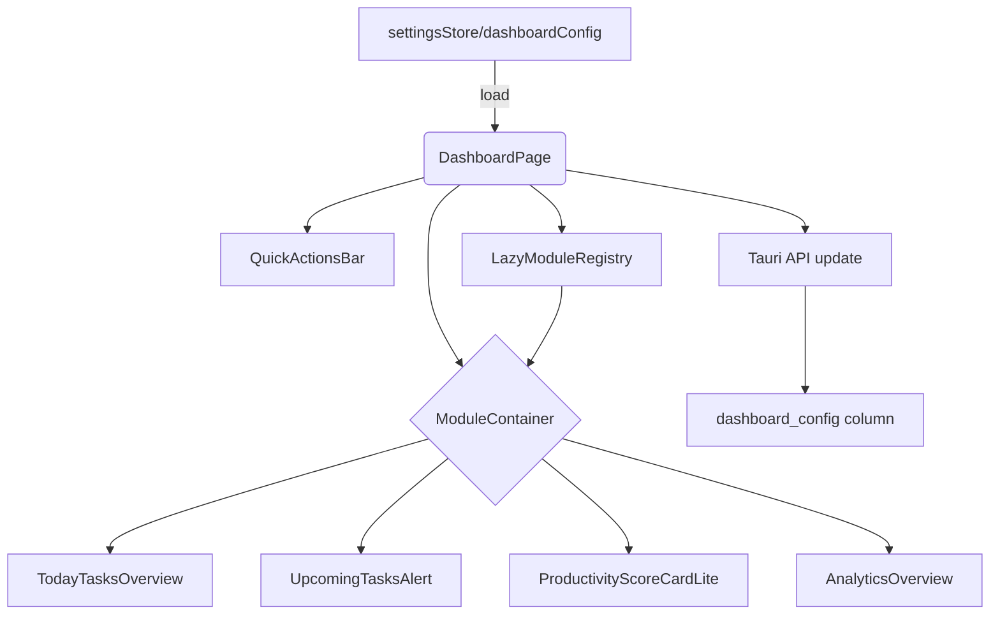

# Dashboard Simplification Design

## Overview

本设计文档描述了 CogniCal 首页仪表盘的重新架构方案。目标是在保持核心洞察的同时降低首屏认知负担，引入模块化渲染体系、快速操作栏以及可配置的模块持久化能力。我们将在 React + Zustand + Tauri 的既有栈内完成前端组件、状态管理、类型扩展与 Rust 命令层改造，确保用户可在设置中自定义仪表盘布局，并在重启应用后保持一致体验。

## Steering Document Alignment

### Technical Standards (tech.md)

- 采用 React 组件拆分、Tailwind + shadcn/ui 组合，满足前端技术栈约定。
- 状态管理继续沿用 Zustand，与 React Query/Tauri IPC 相协同，符合现有模式。
- 后端命令层使用 Rust + Tauri Command，遵循既有错误处理和 JSON 序列化规范。
- SQLite 作为持久化介质，配置数据以 JSON 字符串存储，呼应技术文档中对本地存储的要求。

### Project Structure (structure.md)

- 新组件置于 `src/components/dashboard/`，遵循“按领域”组织方式。
- 类型定义集中在 `src/types/dashboard.ts`，并由 `src/types/settings.ts` 引用，保持类型模块化。
- 新的设置表单落在现有 `src/components/settings/` 结构下，与既有设置组件保持一致。
- Rust 侧迁移与命令更新对齐 `src-tauri/src/` 的分层：`db/` 负责 schema、`commands/` 负责业务逻辑。

## Code Reuse Analysis

### Existing Components to Leverage

- **`AnalyticsOverview`**：作为完整模式下的分析模块引用，在精简模式中通过懒加载与条件渲染使用。
- **`WorkloadForecastBanner` 与 `WeeklySummaryPanel`**：改造成可选模块，无需重写业务逻辑。
- **`useTasks` / `useProductivityScore` / `useWorkloadForecast` hooks**：提供任务与分析数据源。
- **`settingsStore`**：扩展以存储 `dashboardConfig`，复用加载/更新模式。
- **UI 基件**：`src/components/ui/button.tsx`、`card.tsx`、`alert.tsx` 等沿用以保持视觉统一。

### Integration Points

- **Tauri API (`src/services/tauriApi.ts`)**：新增 `fetchDashboardConfig`、`updateDashboardConfig` 方法，与 Rust 命令交互。
- **SQLite 设置表**：在 `src-tauri/src/db/migrations.rs` 内添加 `dashboard_config` JSON 字段，默认存储精简布局配置。
- **React Router**：快速操作栏使用既有导航与模态触发能力（创建任务对话框、路由推送）。

## Architecture

仪表盘页面将拆分为三个层次：

1. **配置层**：从设置 Store 中读取/写入 `DashboardConfig`，供前端渲染驱动。
2. **页面编排层**：`DashboardPage` 使用配置生成模块列表，并通过 `ModuleContainer` 负责条件渲染与懒加载。
3. **模块层**：各功能模块（任务概览、提醒、生产力评分等）作为独立组件，通过 props 获取数据或调用 hooks。



### Modular Design Principles

- **Single File Responsibility**：每个模块组件仅处理自身展示逻辑；共享逻辑通过 hooks/utilities 提供。
- **Component Isolation**：模块之间无直接依赖，通过配置与数据源解耦。
- **Service Layer Separation**：设置持久化逻辑仍位于 Tauri 命令层；React 仅负责调用。
- **Utility Modularity**：新增 `src/utils/dashboardConfig.ts`（若需要），提供默认配置与验证工具。

## Components and Interfaces

### `DashboardPage`（更新）

- **Purpose:** 渲染快速操作栏与模块容器，根据配置决定模块顺序与可见性。
- **Interfaces:** 无新增 props；内部使用 `useDashboardConfig` hook（包装 `settingsStore`）。
- **Dependencies:** `useSettingsStore`, `ModuleContainer`, `QuickActionsBar`, 各模块映射。
- **Reuses:** 现有 `AnalyticsOverview`, `WorkloadForecastBanner`, `WeeklySummaryPanel`。

### `ModuleContainer`

- **Purpose:** 标准化模块渲染，处理懒加载、loading/error 状态与可访问性包装。
- **Interfaces:** `ModuleContainerProps { id, title, description?, visible, lazy, children, fallback }`。
- **Dependencies:** React `Suspense`, `Card` 组件。
- **Reuses:** 复用 UI 基件，遵守 shadcn 风格。

### `QuickActionsBar`

- **Purpose:** 提供三个快捷操作按钮，支持键盘导航与响应式布局。
- **Interfaces:** 无外部 props，内部读取 `useTaskForm`、`useNavigate` 等。
- **Dependencies:** `Button`, 图标库，`useTaskForm`（打开任务创建面板）。
- **Reuses:** 现有对话框控制逻辑、路由导航。

### `TodayTasksOverview`

- **Purpose:** 显示今日任务数量、状态、快捷操作。
- **Interfaces:** 接收来自 `useTasks` 的数据，可配置显示最大条数。
- **Dependencies:** `useTasks`, `Badge`, `Button`, `TaskListItem`（若存在）。
- **Reuses:** 任务 hooks、共享 UI。

### `UpcomingTasksAlert`

- **Purpose:** 根据阈值显示临近到期任务的提醒，并提供跳转链接。
- **Interfaces:** `thresholdHours`（默认 24），`maxItems`（默认 3）。
- **Dependencies:** `useTasks`, `Alert`, 日期工具（`dayjs`）。

### `ProductivityScoreCardLite`

- **Purpose:** 提供简化的生产力评分视图，支持展开详细指标。
- **Interfaces:** 控制展开状态、回调。
- **Dependencies:** `useProductivityScore`, `Card`, `Chart` 子组件。
- **Reuses:** 既有生产力指标 hooks。

### `DashboardSettingsForm`

- **Purpose:** 在设置页提供模块开关、完整模式提示与恢复默认按钮。
- **Interfaces:** 表单受控 props 由 `useDashboardConfig` 传入；提交回调调用 `updateDashboardConfig`。
- **Dependencies:** `Form`, `Switch`, `Checkbox`, `Button`, `Alert`。
- **Reuses:** 既有设置表单工具与 `useSettingsStore` 保存逻辑。

### `useDashboardConfig`（新 hook）

- **Purpose:** 包装 `settingsStore` 的加载/更新流程，提供默认配置回退与错误处理。
- **Interfaces:** `{ config, isLoading, error, toggleModule, reset, save }`。
- **Dependencies:** `useSettingsStore`, `DEFAULT_DASHBOARD_CONFIG`。

## Data Models

### TypeScript 模型（`src/types/dashboard.ts`）

```ts
export type DashboardModuleId =
  | 'quick-actions'
  | 'today-tasks'
  | 'upcoming-alerts'
  | 'productivity-lite'
  | 'analytics-overview'
  | 'wellness-summary'
  | 'workload-forecast';

export interface DashboardModule {
  id: DashboardModuleId;
  title: string;
  enabledByDefault: boolean;
  lazy?: boolean;
  order: number;
}

export interface DashboardConfig {
  modules: Record<DashboardModuleId, boolean>;
  lastUpdatedAt: string;
}

export interface QuickAction {
  id: 'create-task' | 'open-calendar' | 'smart-plan';
  label: string;
  tooltip: string;
  action: 'openModal' | 'navigate';
  target: string;
}
```

### 数据库存储（`dashboard_config` 字段）

```sql
ALTER TABLE settings ADD COLUMN dashboard_config TEXT NOT NULL DEFAULT '{"modules":{"quick-actions":true,"today-tasks":true,"upcoming-alerts":true,"productivity-lite":true,"analytics-overview":false,"wellness-summary":false,"workload-forecast":false},"lastUpdatedAt":""}';
```

- 序列化为 JSON 文本；加载时解析为 `DashboardConfig`。
- 迁移脚本需在现有事务中插入，确保幂等。

## Error Handling

### Error Scenarios

1. **配置加载失败**（如 Tauri 命令抛错或 JSON 解析失败）
   - **Handling:** `useDashboardConfig` 捕获错误，回退到内置默认配置并向 `toast-provider` 发出错误通知。
   - **User Impact:** 仪表盘显示默认模块，同时提示“配置未能加载，已恢复默认设置”。

2. **配置保存失败**（数据库写入或 IPC 失败）
   - **Handling:** 在设置表单中显示错误提示，保持切换状态与持久化状态一致（回滚 UI）。
   - **User Impact:** 用户看到保存失败提示，可重试；原有配置不变。

3. **模块渲染异常**（数据缺失或组件内部错误）
   - **Handling:** `ModuleContainer` 捕获 Promise rejection，显示降级 UI 并记录日志。
   - **User Impact:** 其他模块正常显示，错误模块提供“重试”按钮。

## Testing Strategy

### Unit Testing

- 为 `useDashboardConfig` 编写测试，验证默认回退、toggle/reset/save 行为。
- 测试 `ModuleContainer` 的懒加载、降级渲染逻辑。
- 验证新类型工具（如 `isModuleEnabled` utility）在边界场景下的正确性。

### Integration Testing

- 在 `src/__tests__/dashboard.integration.test.tsx` 中新增场景：根据配置显示/隐藏模块、展开/收起生产力卡片、快速操作响应。
- Mock `settingsStore`/`tauriApi`，覆盖保存失败、加载失败流程。

### End-to-End Testing

- 更新 Playwright 测试：
  - 验证默认精简布局（三个模块+快速操作栏）。
  - 在设置页启用全部模块后返回仪表盘，检查模块完整渲染。
  - 检查移动断点下快速操作栏布局（可通过 viewport 切换实现）。
- Rust 层运行 `cargo test` 覆盖配置命令与数据库迁移。
