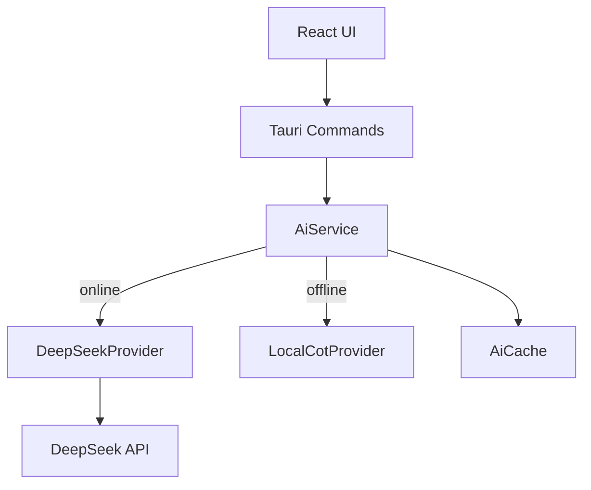

# Design Document: DeepSeek API Integration

## Overview

Implement real DeepSeek API integration across CogniCal to replace placeholder local-only logic. Provide a robust, privacy-first, and resilient AI layer that powers: task parsing, recommendations, and scheduling. Ensure seamless online/offline switching with a shared provider interface and clear UI state.

## Steering Document Alignment

### Technical Standards (tech.md)

- Use Tauri 2 + Rust for backend services (HTTP via reqwest)
- React + TypeScript frontend with Zustand and Query
- Separate service layer (Rust) from UI; expose via Tauri Commands
- Follow module isolation: `ai_service.rs`, `cot_engine.rs`, `prompt_templates.rs`, `ai_cache.rs`
- Testing with Vitest (frontend), cargo test (Rust), Playwright for E2E

### Project Structure (structure.md)

- Place Rust services under `src-tauri/src/services/`
- Tauri commands defined in `src-tauri/src/commands/`
- Frontend hooks in `src/hooks/`, stores under `src/stores/`
- Types under `src/types/`

## Code Reuse Analysis

### Existing Components to Leverage

- `src-tauri/src/services/ai_service.rs`: Base for wiring DeepSeek HTTP calls
- `src-tauri/src/services/cot_engine.rs`: Offline fallback engine
- `src-tauri/src/services/planning_service.rs`: Scheduling integration points
- `src/stores/settingsStore.ts`: Place to store AI settings (API key, mode)
- `src/hooks/useTaskForm.ts`: Entry point for AI task parsing UX

### Integration Points

- Tauri Command: `ai_parse_task`, `ai_generate_recommendations`, `ai_plan_schedule`
- Database: store encrypted API key and AI telemetry in SQLite (`ai_settings`, `ai_cache`)
- UI: Settings page to configure key; onboarding to prompt configuration

## Architecture

### High-Level

- Provider Interface (Trait): `AIProvider` with `parse_task`, `generate_recommendations`, `plan_schedule`
- Implementations:
  - Online: `DeepSeekProvider` (HTTP via reqwest)
  - Offline: `LocalCotProvider` (existing `cot_engine`)
- Selector/Facade: `AiService` decides which provider to call based on connectivity and settings
- Caching Layer: `AiCache` computes cache keys and stores results
- Prompt Templates: YAML-based templates loaded at startup; hot-reloadable

### Modular Design Principles

- Single file responsibility per module
- Clear boundary: Provider interface vs concrete implementations
- Error types are structured enums; mapped to UI-friendly messages
- Backoff + retry policies centralized



## Components and Interfaces

### Trait: AIProvider (Rust)

- Purpose: Unified interface for AI operations
- Interfaces:
  - `async fn parse_task(input: &str, ctx: Context) -> AppResult<ParsedTask>`
  - `async fn generate_recommendations(task: &Task, ctx: Context) -> AppResult<Recommendations>`
  - `async fn plan_schedule(tasks: &[Task], ctx: Context) -> AppResult<Plan>`
- Dependencies: common types (`Task`, `Plan`, etc.)

### Struct: DeepSeekProvider

- Purpose: Online provider calling DeepSeek API
- Interfaces:
  - Internal `invoke_chat(payload) -> AppResult<ChatResponse>`
  - Public methods implementing AIProvider
- Dependencies: `reqwest`, `serde`, `tokio`, `prompt_templates`
- Reuses: HTTP client configuration (timeout 10s), retry policy

### Struct: LocalCotProvider

- Purpose: Offline provider using `cot_engine`
- Reuses: existing logic; adapt to AIProvider trait

### Facade: AiService

- Purpose: Route calls to providers, manage cache, metrics, and mode switching
- Interfaces (exposed via Tauri Commands):
  - `ai_parse_task(input: String) -> ParsedTaskDTO`
  - `ai_generate_recommendations(task_id: i64) -> RecommendationsDTO`
  - `ai_plan_schedule() -> PlanDTO`
- Dependencies: providers, cache, keyring, db

### Frontend Hook: useAI

- Purpose: Single entry for UI to call AI features
- Interfaces:
  - `parseTask(input: string): Promise<ParsedTask>`
  - `generateRecommendations(taskId: string): Promise<Recommendations>`
  - `planSchedule(): Promise<Plan>`
  - `mode: 'online' | 'offline'`
  - `stats: { callsToday, successRate, avgLatency }`
- Dependencies: Tauri invoke, Zustand store

## Data Models

### Rust Types

```
pub struct ParsedTask {
  pub title: String,
  pub description: Option<String>,
  pub priority: Option<String>,
  pub due_at: Option<String>,
  pub planned_start_at: Option<String>,
  pub estimated_hours: Option<f32>,
  pub tags: Vec<String>,
  pub cot_steps: Vec<String>,
  pub confidence: f32,
}

pub struct Recommendations {
  pub priority: String,
  pub start_at: Option<String>,
  pub effort_hours: Option<f32>,
  pub reasons: Vec<String>,
  pub conflicts: Vec<String>,
  pub confidence: f32,
}

pub struct Plan {
  pub items: Vec<PlanItem>,
  pub conflicts: Vec<String>,
}

pub struct PlanItem {
  pub task_id: i64,
  pub start: String,
  pub end: String,
  pub notes: Option<String>,
}
```

### SQLite Schema Changes

```
CREATE TABLE IF NOT EXISTS ai_settings (
  id INTEGER PRIMARY KEY CHECK (id = 1),
  encrypted_api_key BLOB NOT NULL,
  created_at TEXT NOT NULL,
  updated_at TEXT NOT NULL
);

CREATE TABLE IF NOT EXISTS ai_cache (
  cache_key TEXT PRIMARY KEY,
  result_json TEXT NOT NULL,
  created_at TEXT NOT NULL,
  expires_at TEXT NOT NULL
);
```

## IPC and HTTP

### Tauri Commands

- `ai_parse_task(input: String)` → calls AiService; returns ParsedTaskDTO
- `ai_generate_recommendations(task_id: i64)` → returns RecommendationsDTO
- `ai_plan_schedule()` → returns PlanDTO

### HTTP Requests

- Base URL: from settings (default `https://api.deepseek.com`)
- Endpoint: `/v1/chat/completions`
- Headers: `Authorization: Bearer <api_key>`, `Content-Type: application/json`
- Payload patterns per operation with system/user messages and JSON schema hints
- Timeout: 10s; Retry: 3 with backoff (1s/2s/4s)

## Error Handling

### Error Scenarios

1. Invalid API Key (401)
   - Handling: surface user error; suggest re-config; switch to offline upon repeat failures
   - UI: toast "API Key 无效" + CTA to Settings
2. Rate Limited (429)
   - Handling: switch to offline; set cooldown; notify user
   - UI: banner "配额已用尽，已切换离线"
3. Timeout/Network Errors
   - Handling: retry with backoff; then offline fallback
   - UI: inline error with retry button
4. Server Error (5xx)
   - Handling: do not retry; offline fallback
   - UI: notification + optional details panel

## Security

- Encrypt API key with AES-256-GCM; key from OS keyring
- HTTPS only; redact sensitive logs
- Do not persist full request/response; cache only normalized results

## Testing Strategy

### Unit Testing (Rust)

- Mock DeepSeek HTTP using `httpmock` or `wiremock-rs`
- Test: payload formation, error mapping, caching

### Integration Testing (Rust + Frontend)

- Simulate success/failure paths via mocked provider
- Verify offline fallback and UI states

### End-to-End (Playwright)

- Scenario: configure API key → create task with natural text → see parsed fields and CoT → accept updates
- Scenario: network off → fallback message → local parse works

## UI Changes

- Settings: add AI section (API Key input, test button, mode indicator)
- Onboarding: step to configure API Key
- Status badge in header: Online/Offline indicator
- Task form: show "AI 分析中" and CoT collapsible panel

## Metrics & Telemetry (Local Only)

- Track callsToday, successRate, avgLatency in local store
- Display in Settings; allow user to clear stats

## Migration Plan

- Add new tables via migration; idempotent
- Implement provider without breaking existing CoT engine
- Feature flag default: offline; prompt to enable online
