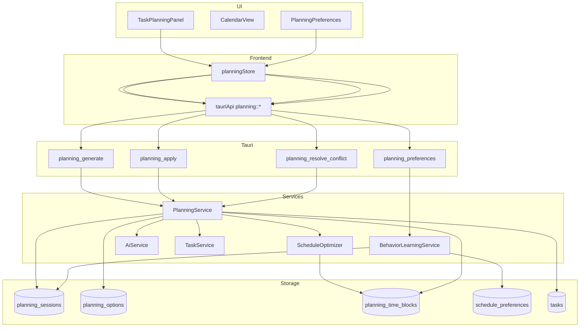

# Design Document

## Overview

Phase 2「任务规划智能体 + 智能调度」将在既有智能解析基础上，为用户生成可执行的推进策略、自动化的时间块排程，并在冲突场景下提供透明的决策依据。方案需覆盖前端交互、Tauri 命令层、Rust 服务层与本地 SQLite 存储，以本地优先、可解释、可干预为核心原则。

## Steering Document Alignment

### Technical Standards (tech.md)

- 继续使用 React 18 + Zustand 管理 UI 状态，Tauri Command 作为前后端唯一通信通道，满足「前端/后端分层 + 服务层封装」标准。
- 规划智能体复用现有 `AiService` 与 `CotEngine`，并在 Rust 服务层拆分 `PlanningService`、`ScheduleOptimizer`、`BehaviorLearningService` 三个模块，符合 tech.md 中的「业务逻辑集中在服务层」「算法组件可独立测试」规范。
- 所有生成数据持久化到 SQLite，延续本地优先与离线降级策略，并通过 `CacheService` 记录推理缓存命中，保持性能指标。

### Project Structure (structure.md)

- 新增 Rust 模块放置在 `src-tauri/src/services/` 与 `src-tauri/src/commands/` 下，与现有 `task_service.rs`、`ai_service.rs` 的组织方式保持一致；数据结构放入 `src-tauri/src/models/`。
- 前端新增的状态与组件将放入 `src/stores/planningStore.ts`、`src/hooks/usePlanning.ts`、`src/components/tasks/` 下，遵循结构文档对组件/Hook 分类的要求；时间块展示集成在 `src/pages/Calendar.tsx`。
- 新增 TypeScript 类型定义放在 `src/types/planning.ts`，便于与现有 `types/task.ts`、`utils/validators.ts` 配合。

## Code Reuse Analysis

### Existing Components to Leverage

- **`AiService`/`CotEngine`**：继续承担 CoT 推理与离线降级能力，用于生成方案摘要、冲突解释。
- **`TaskService`**：提供任务数据读写，`PlanningService` 将基于其 `list_tasks`/`get_task` 获取上下文，并在用户确认方案后调用 `update_task` 写入计划字段。
- **`CacheService`**：用来缓存多方案生成结果，避免重复调用 DeepSeek。
- **前端 `tauriApi`**：扩展现有 invoke 封装，新增规划相关命令；沿用 `toAppError`、`isAppError` 进行错误映射。
- **`TaskTable`、`TaskDetailsDrawer`**：在详情抽屉中注入“生成计划”入口，无需重建列表。
- **`Calendar.tsx`**：复用现有日/周视图容器，只需新增时间块数据源与样式。

### Integration Points

- **Tauri Commands**：新增 `planning_generate`, `planning_apply`, `planning_resolve_conflict`, `planning_preferences_get/update`，沿用 `CommandResult` 错误包装。
- **SQLite**：扩展 schema 存储规划会话、方案、时间块、行为偏好；通过 `DbPool` 访问，与现有任务表保持事务一致性。
- **事件总线**：使用 `tauri::AppHandle::emit` 广播 `planning://progress`、`planning://applied` 事件，前端 `planningStore` 订阅后刷新界面。

## Architecture

Phase 2 引入“规划服务层 + 个性化学习 + 日历同步”三段流水线：

1. 前端收集选中任务和约束，调用 `planning_generate`。
2. Rust `PlanningService` 调用 `PlanningAgent`（聚合 `TaskService`、`ScheduleOptimizer`、`AiService`）生成 2-3 套方案，写入 `planning_sessions`、`planning_options`、暂存时间块候选。
3. 用户选择方案后，前端调用 `planning_apply`，由 `ScheduleSyncService` 落盘 `planning_time_blocks`，并更新任务计划字段，触发冲突检测；如存在冲突，`PlanningService` 返回冲突列表供 UI 展示并调用 `planning_resolve_conflict`。
4. 任务执行完成或延迟时，`BehaviorLearningService` 依据反馈更新 `schedule_preferences`，下一次生成方案时作为约束输入。



### Modular Design Principles

- **单文件职责**：`planning_service.rs` 只负责 orchestrator；`schedule_optimizer.rs` 负责 MCTS/多目标调度；`behavior_learning.rs` 负责偏好计算；前端对应创建独立 hooks/store。
- **组件隔离**：UI 面拆分为 `TaskPlanningPanel`（选择与结果）、`PlanOptionCard`（单个方案）、`ConflictResolutionSheet`、`PersonalizationDialog`。
- **服务层分离**：命令 -> 服务 -> 仓储（repositories）层清晰分工，便于单元测试。
- **工具模块化**：调度算法中的评分函数、日期操作抽离到 `services/schedule_utils.rs` 与前端 `utils/schedule.ts`。

## Components and Interfaces

### 后端：PlanningService

- **Purpose**：组合任务数据、算法、AI 解释生成规划会话。
- **Interfaces**：
  - `generate_plan(session_input) -> PlanningSession`（含 options, conflicts, personalization snapshot）
  - `apply_option(session_id, option_id, overrides) -> AppliedPlan`
  - `resolve_conflict(session_id, conflict_id, resolution) -> PlanningSession`
- **Dependencies**：`TaskService`, `AiService`, `ScheduleOptimizer`, `PlanningRepository`, `BehaviorLearningService`。
- **Reuses**：复用 `TaskService::list_tasks`、`AiService::parse_task`。

### 后端：ScheduleOptimizer

- **Purpose**：根据任务估算、约束、偏好生成候选时间块与评分。
- **Interfaces**：
  - `generate_options(tasks, constraints, preferences) -> Vec<PlanOption>`
  - `detect_conflicts(blocks, existing_events) -> Vec<Conflict>`
- **Dependencies**：`PlanningRepository`（获取历史时间块）、`BehaviorLearningService`（偏好权重）。
- **Reuses**：`CotEngine` 提供 CoT 步骤解释模板。

### 后端：BehaviorLearningService

- **Purpose**：收集执行记录并更新个性化参数。
- **Interfaces**：
  - `snapshot_preferences(user_id) -> Preferences`（生成前作为输入）
  - `ingest_feedback(feedback) -> Preferences`（任务完成/推迟时调用）
- **Dependencies**：`DbPool`, `TaskService`（读取完成情况）。
- **Reuses**：与 `CacheService` 协作缓存偏好。

### 前端：planningStore (Zustand)

- **Purpose**：统一管理规划会话、加载态、冲突及偏好。
- **Interfaces**：`generatePlan`, `applyOption`, `resolveConflict`, `loadPreferences`, `updatePreferences`。
- **Dependencies**：`tauriApi` 新增方法、`uiStore` 提示。
- **Reuses**：沿用 `taskStore` 的错误处理模式。

### 前端：TaskPlanningPanel

- **Purpose**：在任务界面触发计划生成并展示方案。
- **Interfaces**：接收来自 `planningStore` 的 session/options/conflicts，提供点击事件。
- **Dependencies**：`PlanOptionCard`, `ConflictResolutionSheet`。
- **Reuses**：`TaskTable` 的选中状态、`TaskFormDialog` 打开抽屉。

## Data Models

### `planning_sessions`

```
- id: TEXT primary key
- task_ids: TEXT  -- JSON 数组，记录上下文任务
- constraints: TEXT  -- JSON，包含每日上限、可用时段等
- generated_at: TEXT
- status: TEXT  -- pending/applied/cancelled
- selected_option_id: TEXT NULL
- personalization_snapshot: TEXT  -- 生成时的偏好参数
- created_at: TEXT
- updated_at: TEXT
```

### `planning_options`

```
- id: TEXT primary key
- session_id: TEXT foreign key -> planning_sessions.id
- rank: INTEGER  -- 推荐顺序
- score: REAL  -- 多目标评分（越高越优）
- summary: TEXT
- cot_steps: TEXT  -- JSON 数组，用于前端解释
- risk_notes: TEXT  -- JSON，包含风险提示
- created_at: TEXT
```

### `planning_time_blocks`

```
- id: TEXT primary key
- option_id: TEXT foreign key -> planning_options.id
- task_id: TEXT foreign key -> tasks.id
- start_at: TEXT
- end_at: TEXT
- flexibility: TEXT  -- fixed/flexible
- confidence: REAL
- conflict_flags: TEXT  -- JSON，标记冲突类型
- applied_at: TEXT NULL
- actual_start_at: TEXT NULL
- actual_end_at: TEXT NULL
- status: TEXT  -- planned/completed/slipped
```

### `schedule_preferences`

```
- id: TEXT primary key (单用户可固定为 "default")
- data: TEXT  -- JSON，包含高效时段、最大专注时长、避免时间段等
- updated_at: TEXT
```

## Error Handling

1. **生成方案超时/失败**
   - **Handling**：`PlanningService::generate_plan` 捕获 `ScheduleOptimizer` 或 `AiService` 超时，返回降级方案（仅基于历史统计）并在响应中标记 `isFallback=true`。
   - **User Impact**：前端展示提示条「智能调度已使用离线备选策略」。

2. **写入时间块时数据库异常**
   - **Handling**：`planning_apply` 使用事务写入 `planning_time_blocks` 与 `tasks`，失败时回滚并返回 `CommandError::new("UNKNOWN", ...)`。
   - **User Impact**：UI 弹出错误 toast，并保留会话供重试。

3. **冲突解决方案无效**（用户在冲突解决面板选择的方案与最新数据不匹配）
   - **Handling**：重新触发冲突检测，返回最新冲突列表与消息 `CONFLICT_RESOLUTION_OUTDATED`。
   - **User Impact**：冲突面板刷新内容并提示「日程已发生变化，请重新选择」。

## Testing Strategy

### Unit Testing

- Rust：为 `ScheduleOptimizer` 编写矩阵用例，验证并行任务拆分、缓冲时间计算、冲突检测；为 `BehaviorLearningService` 测试偏好更新逻辑（不同完成率场景）。
- TypeScript：测试 `planningStore` 状态流转、`tauriApi` 错误映射、`utils/schedule.ts` 时间块格式化。

### Integration Testing

- Rust：使用内存 SQLite（`rusqlite::Connection::open_in_memory`）验证 `planning_generate -> planning_apply -> planning_resolve_conflict` 全链路事务；模拟 DeepSeek 缓存命中场景。
- 前端：Vitest + Testing Library 对 `TaskPlanningPanel` 进行交互测试，确保方案展示、冲突对话、偏好保存流程正确。

### End-to-End Testing

- Playwright：新增脚本覆盖「选择多个任务 -> 生成计划 -> 查看方案说明 -> 应用方案 -> 日历出现时间块 -> 处理冲突」完整路径；记录截图确保冲突提示与偏好设置可见。
- Tauri Smoke 测试：在桌面版运行自动脚本调用新命令，验证无崩溃并在日志中输出成功事件。
