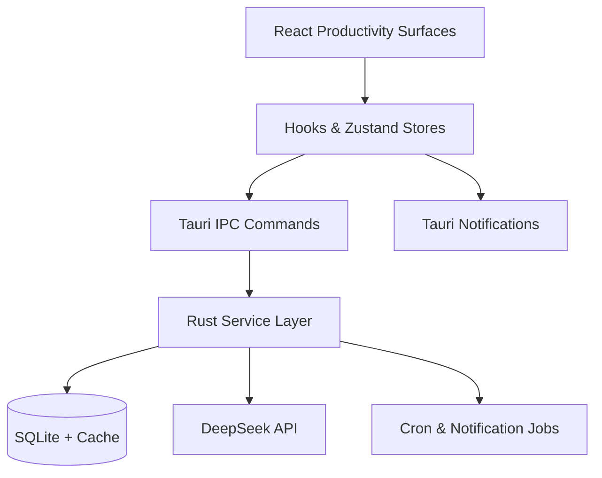

# Design Document - Phase 4 Productivity Optimization

## Overview

Phase 4 turns CogniCal into a proactive productivity co-pilot built on the newly approved requirements. The release adds a multi-dimensional scoring engine, AI-backed planning flows, workload safeguards, rhythm-aware nudges, and transparent feedback/community tooling. The design preserves the privacy-first desktop architecture: all scoring, telemetry, and feedback storage remain local, while DeepSeek-powered reasoning is invoked only when connectivity allows. The solution closes the loop between analytics signals and actionable guidance without introducing paid tiers or breaking the open-source contract.

## Steering Document Alignment

### Technical Standards (tech.md)

- Extend the Rust service layer (`analytics_service`, `recommendation_service`, `forecasting_service`, `feedback_service`, `community_service`) and expose functionality via typed Tauri commands, keeping IPC boundaries thin.
- Continue using SQLite through the existing pooled connection infrastructure; batch jobs run in the Rust scheduler and communicate results to the React client through cached queries exposed over Zustand/React Query hooks.
- DeepSeek access stays encapsulated inside `ai_service` helpers so prompt construction, CoT parsing, and fallback behaviours are reusable and auditable; all outbound requests strip sensitive payloads per the privacy requirements.
- Maintain the dual-agent-ready architecture: new services emit structured events that the forthcoming agents can consume without rework.

### Project Structure (structure.md)

- Frontend additions live alongside existing analytics/planning components (`src/components/analytics`, `src/components/tasks`, new `src/components/productivity` folder if needed) and reuse the shared UI primitives in `src/components/ui`.
- Shared hooks are added under `src/hooks` (`useProductivityScore`, `useRecommendations`, `useWellness`, `useCommunityExports`) backed by new Zustand slices in `src/stores`.
- Rust modules follow the established layout (`src-tauri/src/services/*`, `src-tauri/src/commands/*`, `src-tauri/src/db/models/*`) with single-responsibility files and `mod.rs` re-exports.
- Tests mirror feature placement: Vitest suites in `src/__tests__`, Playwright scenarios in `e2e/`, and Rust integration tests in `tests/integration`.

## Code Reuse Analysis

Phase 4 builds on the analytics foundation from Phase 3 and the planning utilities introduced earlier phases. Minimal net-new surface area is created; instead, existing stores, hooks, and UI scaffolding are extended.

### Existing Components to Leverage

- **`useAnalytics` hook & `AnalyticsOverview`**: incorporate productivity score cards, historical charting, and risk banners without rebuilding dashboard scaffolding.
- **`TaskPlanningPanel` & `TaskAiParsePanel`**: host the expanded recommendation flows, adding multi-option plan presentation and conflict resolution actions.
- **`taskStore` / `planningStore`**: persist user decisions, capacity preferences, and scheduling metadata for the learning loop.
- **`toast-provider` & `Dialog` primitives**: surface wellness nudges, opt-out confirmations, and community export prompts consistently.
- **`tauriApi` service**: extend with typed functions (`getProductivityScore`, `generateRecommendations`, `getWorkloadForecast`, `logAiFeedback`, `createCommunityExport`).

### Integration Points

- **Tauri Commands**: new commands `analytics_get_productivity_score`, `planning_generate_recommendations`, `analytics_get_workload_forecast`, `wellness_get_nudges`, `feedback_submit`, `community_export_bundle` wire the UI to Rust services.
- **SQLite Models**: enrich existing analytics snapshots, add dedicated tables for recommendations, forecasts, feedback, and exports while reusing the migration tooling.
- **DeepSeek API**: invoked via the shared `ai_service` with uniform retry/timeout handling; outputs feed CoT/MCTS helpers for recommendation quality.
- **Desktop Notifications**: use the existing Tauri notification abstraction to deliver deferred nudges and risk alerts outside the active UI.

## Architecture

The solution keeps a clear separation between presentation, state orchestration, service access, and persistence. Local batch workers compute scores and forecasts nightly, while on-demand requests flow through IPC to Rust services and optionally call DeepSeek.



### Modular Design Principles

- **Single File Responsibility**: each new Rust service module covers one domain (scores, recommendations, forecasts, wellness, feedback, community exports).
- **Component Isolation**: UI surfaces split into focused cards/panels (score breakdown, recommendation drawer, wellness center) that compose inside existing dashboards.
- **Service Layer Separation**: command handlers remain thin; heavy lifting lives in services that orchestrate data access, AI calls, and rule evaluation.
- **Utility Modularity**: shared scoring formulas, capacity heuristics, and redaction helpers reside in `src-tauri/src/utils`, enabling reuse in future agent services.

## Components and Interfaces

### Component 1 — `ProductivityScoreEngine` (Rust)

- **Purpose:** Compute composite and per-dimension scores, persist daily snapshots, and expose explanations.
- **Interfaces:** `fn calculate_scores(user_id) -> ScoreBundle`, `fn get_history(range) -> Vec<ScoreSnapshot>`.
- **Dependencies:** `analytics_service` data loaders, `sqlite::analytics_snapshots`, optional DeepSeek summariser for explanation text.
- **Reuses:** Existing analytics aggregations, CoT summariser utilities for rationale strings.

### Component 2 — `ProductivityScorePanel` (React)

- **Purpose:** Render the 0-100 score, dimension chips, hoverable explanations, and trend toggles.
- **Interfaces:** Props derived from `useProductivityScore` hook; emits `onExport`, `onDimensionSelect` events for analytics navigation.
- **Dependencies:** `useAnalyticsStore`, `useProductivityScore`, Recharts for trend visualisation.
- **Reuses:** `SummaryCards`, `ProductivityTrendChart` layout and skeleton states.

### Component 3 — `RecommendationOrchestrator` (Rust)

- **Purpose:** Generate ≥3 scheduling scenarios, detect conflicts, apply user prefs, and log decisions.
- **Interfaces:** `async fn generate_plan(context) -> Vec<PlanOption>`, `fn record_decision(decision)`.
- **Dependencies:** `planning_service`, `ai_service` (DeepSeek), `mcts_solver`, `sqlite::recommendation_sessions`.
- **Reuses:** Existing MCTS utilities, task fetching helpers, calendar conflict detectors.

### Component 4 — `TaskPlanningPanel` Extensions (React)

- **Purpose:** Display ranked plan options with conflict badges, provide adjustment actions, and capture feedback.
- **Interfaces:** Expanded store slice with `requestRecommendations`, `acceptPlan`, `snoozePlan`, `cacheFallbackPlan`.
- **Dependencies:** `usePlanning`, `taskStore`, `planningStore`, `Dialog`/`Sheet` primitives.
- **Reuses:** Current AI plan UI, `ConflictResolutionSheet`, toast helpers.

### Component 5 — `WorkloadForecastService` & `CapacityGuard` (Rust)

- **Purpose:** Run nightly to predict workload horizons, annotate risk levels, and expose drill-down data.
- **Interfaces:** `fn enqueue_daily_job()`, `fn get_forecast(range) -> ForecastBundle`.
- **Dependencies:** `analytics_service`, `planning_service`, `sqlite::workload_forecasts`, scheduler utilities.
- **Reuses:** Existing batch job scheduler, time series smoothing helpers.

### Component 6 — `WellnessNudgeManager` (Rust + React)

- **Purpose:** Track focus streaks, trigger rest reminders, respect quiet hours, and adapt cadence.
- **Interfaces:** `fn evaluate_nudges(now) -> Vec<Nudge>`, `fn record_response(response)`; frontend hook `useWellness` surfaces pending nudges.
- **Dependencies:** `settingsStore` for thresholds, `sqlite::session_metrics`, Tauri notification API.
- **Reuses:** `toast-provider`, `Notification` utilities, session tracking instrumentation from Phase 3.

### Component 7 — `FeedbackCapturePipeline` (Full stack)

- **Purpose:** Store inline 👍/👎 feedback with context, provide retry prompts, and synthesise weekly digests.
- **Interfaces:** Command `feedback_submit`, query `feedback_get_digest`; hook `useFeedback` for UI integration.
- **Dependencies:** `sqlite::ai_feedback`, `ai_service` for optional regenerate, `settingsStore` privacy flags.
- **Reuses:** Existing feedback modals (if any) and toast messaging.

### Component 8 — `CommunityTransparencyCenter`

- **Purpose:** Surface OSS assurances, enable export of anonymised usage bundles, and list detected plugins.
- **Interfaces:** Commands `community_export_bundle`, `community_detect_plugins`; React sheet `CommunityExportDialog`.
- **Dependencies:** `community_service`, file system access, cache of plugin metadata.
- **Reuses:** `Card`, `Dialog`, file export utilities already in analytics export flow.

## Data Models

### `productivity_scores`

```
- snapshot_date: TEXT PRIMARY KEY (ISO date)
- composite_score: REAL NOT NULL
- dimension_scores: TEXT NOT NULL -- JSON map {"completion": number, ...}
- weight_breakdown: TEXT NOT NULL -- JSON map of weights
- explanation: TEXT -- CoT summary (markdown-safe)
- created_at: TEXT NOT NULL DEFAULT CURRENT_TIMESTAMP
```

### `recommendation_sessions`

```
- id: INTEGER PRIMARY KEY
- generated_at: TEXT NOT NULL
- context_hash: TEXT NOT NULL
- plans: TEXT NOT NULL -- JSON array of plan options
- source: TEXT NOT NULL CHECK(source IN ('deepseek', 'cached', 'heuristic'))
- network_status: TEXT NOT NULL CHECK(network_status IN ('online', 'offline'))
- expires_at: TEXT
```

### `recommendation_decisions`

```
- id: INTEGER PRIMARY KEY
- session_id: INTEGER NOT NULL REFERENCES recommendation_sessions(id)
- user_action: TEXT NOT NULL CHECK(user_action IN ('accepted', 'rejected', 'adjusted'))
- adjustment_payload: TEXT
- responded_at: TEXT NOT NULL
- preference_tags: TEXT -- JSON array
```

### `workload_forecasts`

```
- horizon: TEXT NOT NULL CHECK(horizon IN ('7d', '14d', '30d'))
- generated_at: TEXT NOT NULL
- risk_level: TEXT NOT NULL CHECK(risk_level IN ('ok', 'warning', 'critical'))
- total_hours: REAL NOT NULL
- capacity_threshold: REAL NOT NULL
- contributing_tasks: TEXT NOT NULL -- JSON array
- confidence: REAL NOT NULL
- PRIMARY KEY (horizon, generated_at)
```

### `wellness_events`

```
- id: INTEGER PRIMARY KEY
- window_start: TEXT NOT NULL
- trigger_reason: TEXT NOT NULL CHECK(trigger_reason IN ('focus_streak', 'work_streak'))
- recommended_break_minutes: INTEGER NOT NULL
- suggested_micro_task: TEXT
- response: TEXT CHECK(response IN ('completed', 'snoozed', 'ignored'))
- response_at: TEXT
- deferral_count: INTEGER NOT NULL DEFAULT 0
```

### `ai_feedback`

```
- id: INTEGER PRIMARY KEY
- surface: TEXT NOT NULL CHECK(surface IN ('score', 'recommendation', 'forecast'))
- session_id: INTEGER
- sentiment: TEXT NOT NULL CHECK(sentiment IN ('up', 'down'))
- note: TEXT
- prompt_snapshot: TEXT NOT NULL
- context_snapshot: TEXT NOT NULL
- created_at: TEXT NOT NULL DEFAULT CURRENT_TIMESTAMP
- anonymized: BOOLEAN NOT NULL DEFAULT 1
```

### `community_exports`

```
- id: INTEGER PRIMARY KEY
- generated_at: TEXT NOT NULL
- payload_path: TEXT NOT NULL
- metrics_summary: TEXT NOT NULL -- JSON object
- includes_feedback: BOOLEAN NOT NULL DEFAULT 0
- checksum: TEXT NOT NULL
```

Existing tables (`analytics_snapshots`, `task_preferences`) gain extra columns for rest compliance metrics and capacity thresholds through migrations.

## Error Handling

### Error Scenario 1 — DeepSeek Unavailable

- **Handling:** `RecommendationOrchestrator` falls back to cached `recommendation_sessions` (<=7 days old) or heuristic schedules; UI shows a warning chip indicating offline mode.
- **User Impact:** User receives usable plans with a banner prompting retry when the network is restored.

### Error Scenario 2 — Insufficient Historical Data

- **Handling:** `WorkloadForecastService` tags forecasts with `confidence < 0.4`, switches to heuristic calculations, and records the state for analytics.
- **User Impact:** Dashboard displays "低置信度" labels and guidance for collecting more data.

### Error Scenario 3 — Feedback Opt-Out

- **Handling:** Feedback submission commands check privacy flags and short-circuit with a `403`-style response; frontend hides controls and offers one-click purge of historical feedback.
- **User Impact:** Users see confirmation that data collection is disabled and past entries were removed.

### Error Scenario 4 — Export Package Generation Failure

- **Handling:** `CommunityTransparencyCenter` writes structured logs, retries once with exponential back-off, and surfaces a toast plus action link to view logs.
- **User Impact:** Users get a clear error state with steps to retry or review logs; no partial files left on disk.

## Testing Strategy

### Unit Testing

- Rust: cover scoring formula calculations, risk classifier thresholds, nudge cadence adjustments, and feedback anonymisation helpers.
- TypeScript: test new hooks (`useProductivityScore`, `useRecommendations`, `useWellness`, `useCommunityExports`) with mocked IPC responses and store updates.

### Integration Testing

- Rust integration tests ensure nightly jobs write correct snapshots, forecast risk banners reflect task backlog scenarios, and feedback opt-out flows wipe stored entries.
- Frontend Vitest suites validate rendering of score breakdowns, conflict resolution actions, and export confirmation flows using mocked stores and IPC stubs.

### End-to-End Testing

- Playwright scenarios cover accepting AI recommendations, experiencing capacity warnings, responding to wellness nudges, submitting AI feedback, and generating community export bundles (both online/offline paths).
- Smoke E2E test updated to assert the analytics dashboard now displays the productivity score and shows fallback messaging when DeepSeek is unreachable.
