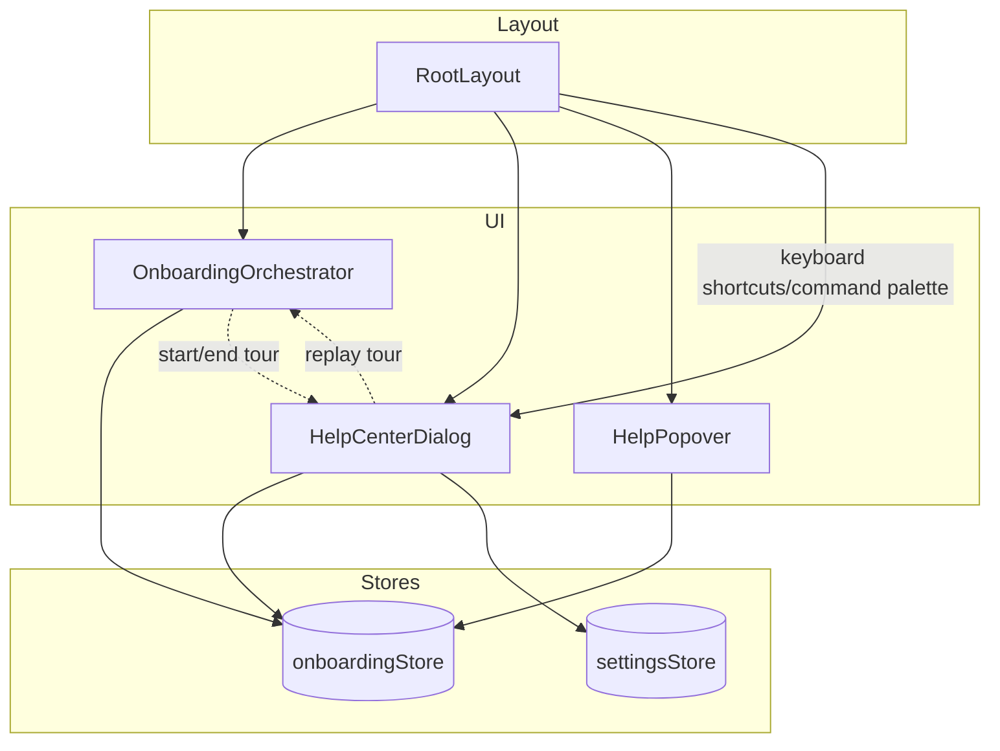

# Design Document

## Overview

Deliver an interactive onboarding stack that introduces first-time CogniCal users to the dashboard, AI task flows, and required settings while keeping contextual help and a reusable help hub available later. The solution wraps three layers:

1. **Tour Orchestrator** – a Driver.js-powered walkthrough that runs on first launch and can be rerun manually.
2. **Contextual Help Controls** – lightweight `?` affordances attached to dense cards and panels that explain purpose/links without navigation.
3. **Help Center Dialog** – a consolidated dialog reachable from sidebar, command palette, or keyboard shortcut with onboarding status, shortcuts, and API guidance.

All surfaces share a single onboarding state service so progress and completion flags persist locally.

## Steering Document Alignment

### Technical Standards (tech.md)

- Stay within the React 18 + TypeScript + Vite stack, using existing Zustand state management for onboarding state with `zustand/middleware` `persist` helper for local storage.
- Reuse the already installed `driver.js` dependency for step highlight UX, matching the recommended modern UI tooling.
- Honor accessibility emphasis by ensuring keyboard focus management and Escape handlers in popovers/dialogs, aligning with shadcn/ui + Radix patterns noted in tech.md.

### Project Structure (structure.md)

- New UI components land under `src/components/onboarding/` and `src/components/help/` to keep feature-specific code grouped.
- The orchestrator integrates at `src/routes/index.tsx` alongside existing providers (similar to command palette wiring) to ensure availability for all routes.
- State store defined in `src/stores/onboardingStore.ts` next to current Zustand stores, following structure.md conventions.
- Shared copy/constants stored in `src/utils/onboarding.ts` to keep separation of data from presentation.

## Code Reuse Analysis

### Existing Components to Leverage

- **`AppShell` + `RootLayout`**: host the tour orchestrator and help hub so all routes inherit functionality.
- **`KeyboardShortcutContext` + command palette**: add entries for help hub and tour replay to maintain unified shortcut/command semantics.
- **`KeyboardShortcutsHelp` dialog**: embed inside the help hub instead of building another shortcuts viewer.
- **`useSettingsStore`**: surface DeepSeek API status inside the help hub without duplicating settings logic.

### Integration Points

- **Navigation/System State**: `RootLayout` toggles the help dialog and triggers tour start based on store flags.
- **Persistence**: Leverage Zustand `persist` middleware with `localStorage` (falls back to in-memory if unavailable) for onboarding progress. No backend changes required.
- **Accessibility Utilities**: reuse shadcn/ui dialog primitives for the help hub and popover primitives for contextual help.

## Architecture

The onboarding system layers on top of existing layout providers, sharing central state and context triggers.



### Modular Design Principles

- **Single File Responsibility**: `OnboardingOrchestrator.tsx` only manages Driver.js lifecycle; dialog contents split into subcomponents (status card, resources list, shortcut embed).
- **Component Isolation**: Contextual help popovers accept copy via props; no direct store coupling to keep them reusable.
- **Service Layer Separation**: `onboardingStore.ts` encapsulates persistence and exposes imperative helpers (`markStepComplete`, `resetTour`, `recordDismissal`).
- **Utility Modularity**: Tour step definitions exported from `utils/onboarding.ts` and consumed by orchestrator and tests.

## Components and Interfaces

### OnboardingOrchestrator

- **Purpose:** Attach Driver.js tour to DOM anchors, monitor completion/dismissal, and respond to manual replay events.
- **Interfaces:** Props-less component hooking into store selectors; exposes `window.dispatchEvent` listener for `onboarding:replay` to keep integration decoupled.
- **Dependencies:** `driver.js`, `onboardingStore`, `useLocation` (to advance step anchors), `KeyboardShortcutContext` for overlay gating.
- **Reuses:** Existing `KeyboardShortcutContext` to avoid shortcut conflicts while tour overlays are visible.

### HelpCenterDialog

- **Purpose:** Provide a Radix dialog summarizing onboarding status, quick actions (replay tour, open shortcuts), FAQ copy, and API key guidance.
- **Interfaces:** Controlled via `open`/`onOpenChange` from `RootLayout`; internally composes sub-panels: `HelpCenterHeader`, `OnboardingSummaryCard`, `ResourceLinks`, `KeyboardShortcutSection` (delegates to `KeyboardShortcutsHelp`).
- **Dependencies:** `onboardingStore`, `useSettingsStore`, `KeyboardShortcutsHelp` component.
- **Reuses:** Shadcn/ui dialog primitives, existing keyboard shortcuts data, and `Button`/`Badge` components.

### HelpPopover

- **Purpose:** Small `?` icon button + Radix popover wrapper showing contextual explanations and optional actions.
- **Interfaces:** `title`, `description`, optional `links[]`, optional `onReplayTour`, `ariaId` props.
- **Dependencies:** Radix Popover, `Button` (ghost variant), `cn` utility.
- **Reuses:** Shared copy provided via `helpCopy` map kept in `utils/onboarding.ts` to avoid duplication.

### Onboarding Store (`useOnboardingStore`)

- **Purpose:** Centralize onboarding progress flags and operations.
- **Interfaces:**
  - `hasCompletedTour: boolean`
  - `lastCompletedStepId?: string`
  - `dismissedAt?: string`
  - `setHasCompletedTour(boolean)`
  - `markStepComplete(stepId)`
  - `resetTour()`
  - `recordDismissal(stepId)`
  - `shouldAutoLaunchTour(): boolean`
- **Dependencies:** Zustand + `persist` middleware.
- **Reuses:** None; purely new store.

## Data Models

### OnboardingProgress (TypeScript)

```
interface OnboardingProgress {
  hasCompletedTour: boolean;
  completedStepIds: string[];
  lastStepId?: string;
  dismissedAt?: string;
  version: number; // for future migrations
}
```

### HelpResourceLink

```
interface HelpResourceLink {
  id: string;
  label: string;
  href: string;
  icon?: LucideIcon;
  hotkey?: string;
}
```

## Error Handling

### Error Scenario 1: Missing Anchor Elements

- **Handling:** Orchestrator checks `document.querySelector` results; if a target is missing it skips the step and logs a warning using `console.warn` (DEV) while continuing.
- **User Impact:** Tour continues with remaining steps; help hub displays a notice allowing manual replay once relevant panel is loaded.

### Error Scenario 2: Persisted State Corruption

- **Handling:** `persist` middleware `onRehydrateStorage` validates schema; on mismatch, reset to defaults and flag `wasReset` so UI can prompt user to rerun tour.
- **User Impact:** User sees help hub card recommending rerunning the tour; no blocking behavior.

### Error Scenario 3: Driver.js Runtime Failure

- **Handling:** Catch orchestrator initialization errors and set `tourStatus` to `disabled`, preventing further auto-runs while showing a fallback toast via `uiStore.pushToast`.
- **User Impact:** User receives notification that guided tour is unavailable but can read help hub content.

## Testing Strategy

### Unit Testing

- Validate `useOnboardingStore` transitions (completion flags, reset logic, version migrations).
- Snapshot test `HelpPopover` to ensure accessibility attributes, and verify escape/close callbacks.
- Test `utils/onboarding.ts` step definitions to ensure each step exports expected selectors and copy.

### Integration Testing

- Add Vitest React Testing Library specs covering `HelpCenterDialog` to confirm data renders (API key warning, onboarding status) and actions dispatch (replay tour event, shortcut dialog toggle).
- Ensure `RootLayout` integration prevents tour auto-launch when `hasCompletedTour` is true and resumes when store reset.

### End-to-End Testing

- Extend Playwright suite with scenarios:
  1. Fresh profile (cleared storage) auto-opens tour, stepping through until completion updates help hub.
  2. Mid-tour reload preserves progress and resumes from next step.
  3. Help popover reachable via keyboard and closes on Escape without losing task edits.
  4. Help hub accessible via Shift+/ shortcut and provides API key CTA when missing.
