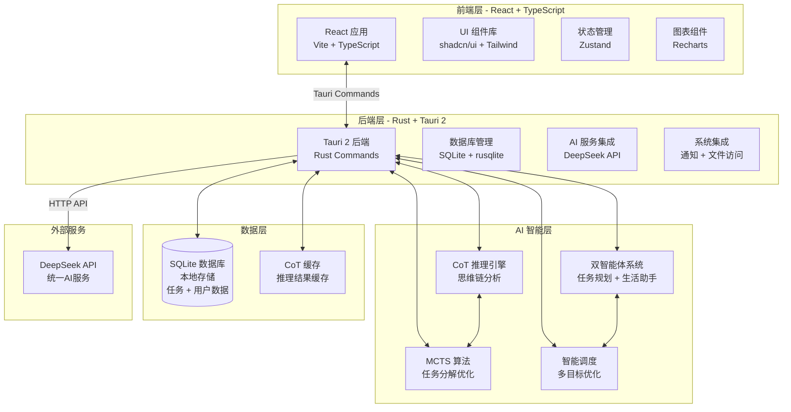

# CogniCal 智能日程管理系统功能文档

## 1. 系统简介

CogniCal 是一款基于人工智能的高度个性化 **桌面日程管理应用**，专注于通过先进的机器学习和日程优化算法为用户提供智能化的任务管理体验。系统集成了自然语言处理、智能调度、习惯建模等前沿技术，旨在打造一个集任务规划、日程安排、生产力洞察于一体的个人生产力平台。

核心价值在于通过 AI 驱动的智能化交互，将复杂的任务规划和时间管理简化为自然语言对话，同时提供深度的数据洞察和个性化推荐，帮助用户构建高效的个人工作流。

### 1.1 Tauri 2 桌面应用优势

- **原生性能**: 接近原生应用的性能和响应速度
- **系统集成**: 完整的系统通知、文件访问、托盘图标支持
- **数据安全**: 本地 SQLite 数据库，数据完全私有
- **离线优先**: 完全离线使用，AI 功能需要网络连接
- **跨平台**: Windows/macOS/Linux 一键打包分发
- **隐私保护**: 所有数据存储在本地，无需云端同步

## 2. 核心功能架构（精简版）

### 2.1 智能任务管理模块

- **自然语言任务创建（基于 CoT 推理）**

  - 基于 DeepSeek 大模型 API 解析用户输入
  - **标准化任务模板**（所有任务创建场景的必填字段）：
    - 标题（必填）：简洁明确的任务名称
    - 详细描述（必填）：任务的具体内容和要求
    - 优先级（必填）：高/中/低三级分类
    - 计划开始时间（必填）：任务预计开始的日期时间
    - 截止时间（必填）：任务必须完成的最后期限
    - 预估工时（必填）：以小时为单位的工作量估算
    - 任务类型（必填）：工作/学习/生活/其他分类
    - 相关标签（必填）：便于分类和检索的关键词标签
  - **CoT 增强字段**（AI 推理生成）：
    - 任务复杂度评分（0-10）：AI 分析任务难度和技能要求
    - AI 建议开始时间：基于用户习惯和工作负载预测的最佳开始时间
    - 专注模式需求：推荐番茄钟数量和专注时间段
    - 时间效率预测：基于历史数据预测实际耗时
  - 智能字段提取：DeepSeek API 从自然语言中自动识别并填充上述 8 个必填字段
  - **CoT 步骤化推理**：AI 通过思维链分析任务需求 → 评估复杂度 → 预测时间 → 提出优化建议
  - 支持预定义任务模板库，快速创建常见任务类型
  - 上下文理解和任务关联推荐：基于历史任务自动识别依赖关系，推荐相关任务分组
  - 模板验证机制：确保所有必填字段完整性，提供缺失字段提醒

- **高级任务管理功能（CoT 驱动）**

  - **智能任务分解（MCTS 策略）**：
    - 使用蒙特卡洛树搜索探索多种分解方案
    - 评估每种方案的可行性和效率
    - 自动生成 3 种分解方案供用户选择
    - 识别可并行执行的子任务
  - **任务依赖关系分析**：
    - CoT 推理识别任务间的逻辑依赖
    - 可视化展示依赖关系图
    - 自动检测循环依赖和冲突
  - **智能时间估算（二分搜索优化）**：
    - 基于历史数据和任务特征预测实际耗时
    - 识别时间估算偏差模式
    - 动态修正预估时间，提高准确度
  - **任务优先级动态调整**：
    - CoT 推理综合考虑截止时间、重要性、依赖关系
    - 实时调整任务执行顺序
    - 提供优先级调整理由说明

- **智能日历视图（CoT 优化调度）**
  - 日/周/月/年视图智能切换
  - **AI 驱动的时间块智能安排**：
    - CoT 推理分析任务优先级、依赖关系、截止时间
    - 多目标优化：最小化逾期风险 + 平衡工作负载 + 预留缓冲时间
    - 自动生成最优执行顺序并说明理由
  - 拖拽式任务重新安排：直观的任务时间调整
  - **冲突检测与智能解决建议**：
    - 自动检测时间冲突和资源冲突
    - CoT 推理提供 3 种冲突解决方案并评估优劣
    - 一键应用推荐方案
  - **时间块可视化与优化建议**：
    - 基于工作习惯识别高效时段
    - 推荐任务与时间段的最佳匹配
    - 可视化展示工作强度和休息安排
  - **专注模式（番茄钟集成）**：
    - 自动计算任务所需专注时段数
    - 智能安排专注时间和休息时间
    - 跟踪专注效率和完成进度

### 2.2 AI 助手集成模块（CoT 推理引擎）

- **DeepSeek API 集成（CoT 增强）**

  - 统一使用 DeepSeek 大模型 API 进行所有 AI 功能
  - **CoT 推理链生成**：
    - 步骤化思考过程：问题分析 → 方案生成 → 评估验证 → 优化建议
    - 推理过程可视化：展示 AI 的思考步骤和决策依据
    - 多方案对比：生成多个解决方案并评估优劣
  - **上下文感知的任务建议**：
    - 基于当前任务和历史数据的深度推理
    - 识别任务模式和用户偏好
    - 提供个性化的执行策略
  - **个性化工作习惯学习**：
    - CoT 分析识别高效工作时段、任务完成规律
    - 学习用户的工作节奏和偏好模式
    - 持续优化推荐准确度
  - **智能调度优化**：
    - 使用 MCTS 策略探索最优调度方案
    - 多维度评估：时间效率、工作负载、截止时间压力
    - 自动避免冲突并提供替代方案

- **对话式智能交互（CoT 对话系统）**
  - **自然语言任务查询**：
    - 支持复杂查询理解（如"找出本周逾期风险最高的任务"）
    - CoT 推理分解查询意图并执行多步检索
  - **智能状态建议**：
    - 基于用户行为模式的 CoT 推理
    - 预测任务状态转换的最佳时机
    - 提供状态更新建议和理由
  - **工作总结与反思引导**：
    - CoT 生成结构化工作总结
    - 识别生产力提升点和改进机会
    - 引导用户进行深度反思
  - **生产力分析与建议**：
    - 多维度数据分析 + CoT 推理
    - 提供个性化的生产力提升建议
    - 说明建议背后的推理逻辑
  - **智能提醒系统**：
    - CoT 推理判断最佳提醒时机
    - 基于任务重要性和用户习惯动态调整
    - 避免过度打扰，优化提醒效果

### 2.3 智能分析与洞察模块

- **深度数据分析仪表板**

  - 任务完成率统计与趋势分析：可视化展示任务完成情况
  - 时间投入分析与优化建议：分析时间使用效率并提供优化建议
  - 效率模式识别：识别用户的高效工作模式
  - 工作习惯可视化：直观展示工作习惯和模式
  - 生产力评分系统：量化评估用户的生产力水平

- **个性化推荐引擎**
  - 基于历史数据的任务优先级推荐：智能推荐任务执行顺序
  - 最佳工作时间段识别：识别用户的高效工作时间段
  - 任务分组与批处理建议：智能推荐任务分组和批处理方案
  - 休息提醒与工作节奏优化：基于工作强度的智能休息提醒
  - 工作负载预测：预测未来工作负载并提供准备建议

### 2.4 本地数据管理模块

- **数据存储**

  - SQLite 数据库：轻量级、高性能的本地存储
  - FTS5 全文搜索：快速检索任务内容
  - 数据完全本地化：无需云端服务，保护隐私
  - 离线优先：完全离线使用能力

- **数据备份与导出**
  - 自动本地备份：定期备份到本地文件系统
  - 多格式导出：支持 JSON、CSV 格式导出
  - 数据恢复：一键恢复历史备份
  - 数据清理：自动清理过期任务，优化存储空间

## 3. 智能体系统架构（精简版）

### 3.1 双智能体系统设计（基于 CoT 推理）

- **任务规划智能体（Task Planning Agent with CoT）**

  - **CoT 推理核心能力**：
    - 步骤化任务分析：需求理解 → 复杂度评估 → 方案生成 → 验证优化
    - MCTS 策略：探索多种规划方案，选择最优路径
    - 二分搜索错误定位：快速识别计划中的问题点
    - 推理过程透明化：展示决策依据和思考步骤
  - 具备上下文记忆和学习能力
  - **长期目标分解与项目管理**：
    - CoT 推理将长期目标分解为可执行任务
    - 识别关键里程碑和依赖关系
    - 生成多阶段执行计划
  - **资源分配优化和时间安排**：
    - 多目标优化算法 + CoT 推理
    - 考虑工作负载、截止时间、优先级
    - 动态调整资源分配策略
  - **任务依赖关系分析和风险评估**：
    - CoT 推理识别潜在风险点
    - 预测任务延迟的连锁影响
    - 提供风险缓解建议
  - **个性化工作模式识别**：
    - 学习用户的工作习惯和偏好
    - 适应个性化的任务执行风格
  - 智能时间块安排和冲突检测
  - 任务优先级动态调整

- **生活助手智能体（Life Assistant Agent with CoT）**
  - **CoT 推理辅助生活管理**：
    - 分析生活任务与工作任务的平衡关系
    - 推理最佳休息时机和活动安排
    - 预测压力累积并提前干预
  - 日常事务智能管理和提醒
  - **习惯养成跟踪和行为分析**：
    - CoT 分析习惯形成过程
    - 识别阻碍因素并提供改进建议
  - **健康管理和工作生活平衡**：
    - CoT 推理评估工作强度
    - 推荐休息和运动安排
    - 预防过度劳累和倦怠
  - **情绪状态识别和压力管理**：
    - 通过任务模式识别情绪状态
    - CoT 推理提供压力缓解建议
  - 社交活动和重要事件提醒
  - 智能休息提醒和工作节奏优化
  - 生活任务与工作任务的平衡协调

### 3.2 智能体协作机制

- **双智能体通信协议**

  - 智能体间消息传递和状态同步（基于 LangGraph）
  - 协作决策和冲突解决机制
  - 共享任务数据和用户习惯信息
  - 工作任务与生活任务的智能协调

- **统一智能体管理**
  - 智能体生命周期管理（启动、运行、暂停、终止）
  - 会话状态管理（Redis 存储）
  - 智能体能力扩展接口（为未来功能预留）

**注**：当前版本为双智能体系统（任务规划 + 生活助手），不包含学习助手等其他智能体。

## 4. 技术栈架构

### 4.0 系统架构图（Tauri 2 桌面应用架构）

**架构说明**:

- **前端层**: React + TypeScript 现代化界面，通过 Tauri Commands 与后端通信
- **后端层**: Rust + Tauri 2 提供高性能本地服务，集成系统功能和 AI 能力
- **AI 智能层**: 完整的 CoT 推理引擎 + MCTS 算法 + 双智能体系统
- **数据层**: SQLite 本地数据库，确保数据隐私和安全
- **外部服务**: DeepSeek API 提供统一的 AI 能力
- **优势**: 原生性能 + 完整智能功能 + 数据隐私保护

### 4.1 前端技术栈（Tauri 2 兼容）

#### 4.1.1 核心框架与构建工具

- **应用框架**: Vite 5.x + React 18 + TypeScript 5.x
  - 优势: 极快的开发体验,与 Tauri 2 完美集成
  - 热重载支持,开发效率高
- **构建工具**: Tauri CLI + Vite
  - 自动构建和打包桌面应用
  - 支持开发模式热重载
- **包管理器**: pnpm (推荐) 或 npm

#### 4.1.2 UI 框架与样式

- **UI 组件库**: shadcn/ui + Radix UI
  - 优势: 组件源码可控,设计系统灵活,TypeScript 友好
  - 现代化设计,高度可定制
- **样式方案**: Tailwind CSS 3.x
  - 原子化 CSS,开发效率高
  - 深色/浅色主题支持
- **图标库**: Lucide React
  - 现代化图标,TypeScript 支持
- **动画库**: Framer Motion
  - 流畅的交互动画效果

#### 4.1.3 状态管理与数据获取

- **全局状态**: Zustand
  - 轻量级状态管理,简单易用
  - 与 Tauri Commands 完美集成
- **数据获取**: 直接调用 Tauri Commands
  - 通过 @tauri-apps/api 调用后端 Rust 函数
  - 类型安全的 API 调用
- **表单管理**: React Hook Form + Zod
  - 类型安全的表单验证
  - 高性能表单处理

#### 4.1.5 图表与数据可视化

- **图表库**: Recharts 或 Chart.js (轻量级)
- **日历视图**: React Big Calendar 或 FullCalendar
- **拖拽交互**: @dnd-kit/core (现代化拖拽库)

#### 4.1.6 开发工具

- **代码质量**: ESLint + Prettier
- **Git Hooks**: Husky + lint-staged
- **类型检查**: TypeScript Compiler

### 4.3 AI 技术栈（DeepSeek API + CoT 推理引擎）

- **AI 服务集成**:

  - DeepSeek 大模型 API（统一 AI 服务）
  - **CoT 推理引擎集成**：
    - Chain-of-Thought 提示工程
    - 步骤化推理过程生成
    - 多方案评估和选择机制
  - 智能任务解析和自然语言处理
  - 上下文理解和推理能力
  - 多轮对话和记忆管理

- **CoT 推理组件**:

  - **CoTDataGenerator**: 核心推理引擎
    - MCTS 策略实现（任务分解、方案探索）
    - 二分搜索错误定位
    - 双 Agent 验证系统（Generator + Verifier）
    - 解决方案树管理
  - **推理评估器**:
    - 相似度评分机制
    - 方案质量验证
    - 推理过程可视化
  - **推理缓存系统**:
    - 常见场景推理结果缓存
    - 加速响应速度
    - 降低 API 调用成本

- **API 管理**:
  - API 密钥安全存储和管理
  - 请求限流和错误处理
  - 响应缓存和性能优化
  - 离线降级处理

### 4.2 后端技术栈（Tauri 2 Rust 后端）

#### 4.2.1 核心框架

- **桌面框架**: Tauri 2.0 + Rust
  - 高性能系统级编程语言
  - 内存安全，无垃圾回收
  - 与前端通过 Commands 通信
- **异步运行时**: Tokio 1.0
  - 高性能异步运行时
  - 支持并发 AI 请求处理

#### 4.2.2 数据库与存储

- **主数据库**: SQLite 3.x
  - 轻量级嵌入式数据库
  - 零配置，单文件存储
  - 完整的 ACID 事务支持
- **数据库驱动**: rusqlite 0.31
  - 类型安全的 SQLite 绑定
  - 异步支持通过 tokio-rusqlite
- **数据缓存**: 内存缓存 + SQLite 表
  - CoT 推理结果缓存到 SQLite
  - 内存中任务状态缓存

#### 4.2.3 系统集成

- **系统通知**: Tauri Notification API
  - 原生系统通知支持
  - 定时提醒和任务通知
- **文件系统**: Tauri FS API
  - 本地文件读写权限
  - 数据备份和导出功能
- **托盘图标**: Tauri Tray API
  - 系统托盘快速访问
  - 后台运行支持

### 4.3 数据存储架构

#### 4.3.1 数据库设计

- **SQLite 表结构**:
  - users: 用户表(id, name, preferences) - 单用户设计
  - tasks: 任务表(完整字段，包含所有智能分析结果)
  - task_dependencies: 任务依赖关系表
  - cot_cache: CoT 推理结果缓存表
  - user_habits: 用户习惯数据表
- **全文搜索**: SQLite FTS5 扩展
- **数据备份**: 自动 SQLite 文件备份到用户目录
  - Real-time Data: `task:updates:{user_id}` (发布/订阅)

#### 4.3.3 数据备份与导出

- **自动备份**:
  - PostgreSQL 定期备份(pg_dump)
  - Redis RDB/AOF 持久化
- **用户导出**:
  - JSON/CSV 格式导出个人数据
  - 符合 GDPR 数据可携带权

### 4.4 AI 与智能体技术栈

#### 4.4.1 AI 服务集成

- **大语言模型**: DeepSeek API (统一 AI 服务)
  - Chat Completions API
  - 流式响应支持
  - 通过 reqwest HTTP 客户端调用
- **API 管理**:
  - API Key 本地加密存储
  - 请求限流和错误重试
  - 成本追踪和优化

#### 4.4.2 CoT 推理引擎（Rust 实现）

- **核心模块**: CoTEngine (Rust 结构体)
  - **MCTS 策略**: 蒙特卡洛树搜索任务分解
  - **二分搜索**: 错误定位算法
  - **双 Agent 验证**: Generator + Verifier 协作
  - **解决方案树**: 多方案生成和评估
- **推理服务层**:
  - `TaskAnalyzer`: 任务分解和复杂度分析
  - `ScheduleOptimizer`: 智能调度优化
  - `ComplexityScorer`: 任务难度评估
  - `DurationPredictor`: 时间预测引擎
- **推理质量保证**:
  - 相似度评分机制
  - 推理过程验证
  - 用户反馈循环
  - 推理结果缓存(SQLite)

#### 4.4.3 智能体框架（Rust 实现）

- **智能体实现**:
  - **任务规划 Agent**: 任务分解、调度优化、风险评估
  - **生活助手 Agent**: 习惯跟踪、健康管理、工作生活平衡
- **状态管理**:
  - 会话状态: SQLite 存储
  - 短期记忆: 内存缓存
  - 长期记忆: SQLite 用户习惯表
- **智能体协作**: 通过消息传递实现双智能体通信

### 4.5 构建与分发架构

#### 4.5.1 构建工具

- **构建工具**: Tauri CLI + Cargo
  - 自动构建多平台安装包
  - 代码签名支持
  - 自动更新机制
- **平台支持**:
  - Windows: .exe 安装包
  - macOS: .dmg 安装包
  - Linux: .AppImage 或 .deb/.rpm

#### 4.5.2 分发方案

- **GitHub Releases**: 免费分发安装包
- **自动更新**: Tauri 自动更新机制
- **零服务器成本**: 无需云服务部署

#### 4.5.3 CI/CD 流程

- **持续集成**: GitHub Actions
  - 代码检查: ESLint + Prettier
  - 类型检查: TypeScript + MyPy
  - 单元测试: Pytest + Vitest
  - E2E 测试: Playwright
- **持续部署**:
  - 主分支推送 → 自动部署到生产环境
  - 功能分支 → 预览环境(Vercel Preview)
  - 数据库迁移自动执行(Alembic)

#### 4.5.4 监控与日志

- **错误追踪**:
  - Sentry (前后端错误监控)
  - 自动错误报告和堆栈跟踪
- **性能监控**:
  - 前端: Vercel Analytics 或 Web Vitals
  - 后端: Prometheus + Grafana (可选)
- **日志管理**:
  - 结构化日志: Python logging + JSON formatter
  - 日志聚合: Loki 或 Papertrail (可选)
- **用户分析**:
  - Plausible Analytics (隐私友好、开源)
  - 或自托管 Umami

#### 4.5.5 开发工具链

- **前端**:
  - 包管理: pnpm 或 npm
  - 代码质量: ESLint + Prettier + TypeScript
  - Git Hooks: Husky + lint-staged
  - 测试: Vitest + React Testing Library + Playwright
- **后端**:
  - 包管理: Poetry 或 pip + requirements.txt
  - 代码质量: Ruff(Linter) + Black(Formatter) + MyPy(类型检查)
  - 测试: Pytest + pytest-asyncio + httpx
- **数据库**:
  - 迁移工具: Alembic
  - 管理工具: pgAdmin 或 DBeaver

## 5. 开发阶段规划

本系统专注于打造智能化程度高、体验优秀的个人日程管理与任务规划工具。开发阶段规划如下：

### Phase 0：Tauri 2 基础架构（1.5-2 个月）

**目标**：搭建完整的 Tauri 2 桌面应用基础架构，实现基础任务管理功能。

**核心交付物**：

**前端部分**:

- [ ] Tauri 2 + React + TypeScript 项目初始化
- [ ] UI 框架配置(shadcn/ui + Tailwind CSS)
- [ ] 单页面应用路由设计
- [ ] 响应式布局(桌面端优化)
- [ ] 深色/浅色主题支持

**后端部分**:

- [ ] Tauri Commands 设计和实现
- [ ] SQLite 数据库设计和表结构
  - users 表(单用户设计)
  - tasks 表(完整字段设计)
- [ ] rusqlite 数据库集成
- [ ] 数据备份和恢复功能

**系统集成**:

- [ ] 系统通知集成
- [ ] 文件系统访问权限
- [ ] 托盘图标和菜单
- [ ] 自动更新配置

**核心功能**:

- [ ] 基础任务 CRUD 功能
- [ ] 任务列表和日历视图
- [ ] 任务状态跟踪
- [ ] 本地搜索功能(SQLite FTS)

**软著申请准备**：

- [ ] 代码注释和文档完善
- [ ] API 文档(FastAPI 自动生成)
- [ ] 功能说明书初稿

**逻辑关联**：

- **Web 架构基础**：前后端分离、用户认证、数据隔离是 SaaS 的必备能力
- **验证核心价值**：快速实现基础任务管理,验证产品方向
- **为多用户做准备**：从一开始就考虑多租户架构
- **开发体验优化**：配置好开发环境和工具链,提高后续开发效率

---

### Phase 1：智能任务解析 + CoT 推理引擎（2.5-3 个月）

**目标**：引入 AI 能力,实现智能任务创建和基础的 CoT 推理功能。

**核心交付物**：

**AI 服务集成**:

- [ ] DeepSeek API 集成与安全管理
  - 用户级别 API Key 管理(存储在 PostgreSQL)
  - 请求限流和配额管理(Redis)
  - API 调用成本追踪
- [ ] 自然语言任务解析(扩展任务模型到 8 个字段)
  - 标题、描述、优先级、截止时间(已有)
  - 新增: 计划开始时间、预估工时、任务类型、标签

**CoT 推理引擎**:

- [ ] **CoTDataGenerator 核心模块**:
  - [ ] 简化版 MCTS 实现(任务分解)
  - [ ] 任务复杂度分析(0-10 评分)
  - [ ] 智能时间预估(置信度 + 区间)
  - [ ] 基础 CoT Prompt 模板库
- [ ] **推理结果缓存**:
  - [ ] Redis 缓存相似任务的推理结果
  - [ ] 缓存失效策略(7 天 TTL)
  - [ ] 缓存命中率监控
- [ ] **推理过程可视化**:
  - [ ] 前端 CoT 分析组件
  - [ ] 展示 AI 思考步骤
  - [ ] 用户反馈收集机制

**任务模型扩展**(数据库迁移):

- [ ] 数据库 Schema 更新(Alembic 迁移)
- [ ] 新增字段:
  - `planned_start_time` (计划开始时间)
  - `estimated_hours` (预估工时)
  - `task_type` (任务类型: 工作/学习/生活/其他)
  - `tags` (标签数组,PostgreSQL ARRAY 或 JSON)
  - `complexity_score` (复杂度评分)
  - `ai_suggested_time` (AI 建议时间)
  - `efficiency_prediction` (效率预测)

**前端功能增强**:

- [ ] 任务创建表单升级(8+ 字段)
- [ ] 实时 AI 分析按钮(复杂度、时间预估)
- [ ] CoT 推理过程展示组件
- [ ] 任务标签管理(创建、筛选、统计)
- [ ] 改进的列表和日历视图(显示新字段)

**搜索与导出**:

- [ ] PostgreSQL 全文搜索(FTS)集成
- [ ] 高级筛选(按类型、标签、复杂度)
- [ ] 数据导出功能(JSON/CSV)

**软著申请准备**：

- [ ] CoT 推理引擎算法文档
- [ ] MCTS 任务分解算法流程图
- [ ] 核心创新点文档整理
- [ ] 软著申请材料准备

**逻辑关联**：

- **AI 能力核心价值**：从手动任务管理到 AI 辅助规划
- **CoT 推理是技术壁垒**：软著和专利的关键创新点
- **用户体验提升**：AI 推理过程透明化,增强信任
- **数据积累**：为 Phase 2 的个性化学习打基础

### Phase 2：任务规划智能体 + 智能调度（2.5-3 个月）

**目标**：实现完整的任务规划智能体系统,提供智能调度和个性化推荐。

**核心交付物**：

**智能体框架**:

- [ ] LangGraph 框架集成
- [ ] 任务规划 Agent 实现:
  - [ ] 状态图设计(任务分析 → 方案生成 → 评估 → 推荐)
  - [ ] DeepSeek Tool Calling 集成
  - [ ] Agent 记忆管理(Redis + PostgreSQL)
- [ ] 智能体会话管理:
  - [ ] LangGraph Checkpointer(Redis)
  - [ ] 多轮对话上下文保持
  - [ ] 会话历史查询

**CoT 推理服务层**:

- [ ] **TaskCoTOptimizer**: 任务规划优化器
  - [ ] MCTS 完整实现(蒙特卡洛树搜索)
  - [ ] 任务分解方案生成(最多 3 个方案)
  - [ ] 方案评分算法(可行性、效率、风险)
  - [ ] 可并行任务识别
- [ ] **ScheduleCoTOptimizer**: 调度优化器
  - [ ] 多目标优化算法(时间、优先级、依赖)
  - [ ] 时间块智能安排
  - [ ] 冲突检测与解决方案生成
  - [ ] 缓冲时间自动计算
- [ ] **ComplexityAnalyzer**: 复杂度分析器增强
  - [ ] 多维度复杂度评估
  - [ ] 技能匹配度分析
- [ ] **DurationPredictor**: 时间预测引擎
  - [ ] 基于历史数据的机器学习模型
  - [ ] 预测偏差自动修正
  - [ ] 置信区间计算

**智能日历视图**:

- [ ] 前端日历组件增强:
  - [ ] 拖拽式任务重新安排
  - [ ] 时间块可视化
  - [ ] 实时冲突提示
- [ ] 后端 API 支持:
  - [ ] 自动调度算法
  - [ ] 冲突检测 API
  - [ ] 批量任务调度

**个性化学习基础**:

- [ ] 用户行为数据收集:
  - [ ] 任务完成时间记录
  - [ ] 工作时段统计
  - [ ] 任务偏好分析
- [ ] 习惯识别算法:
  - [ ] 高效时段识别(按小时统计)
  - [ ] 任务完成模式分析
  - [ ] 工作节奏建模
- [ ] 数据库表设计:
  - [ ] `user_habits` 表(工作偏好)
  - [ ] `task_completions` 表(完成记录)
  - [ ] `time_blocks` 表(时间块统计)

**性能优化**:

- [ ] 推理结果缓存优化
- [ ] 数据库查询优化(索引、分页)
- [ ] API 响应时间优化(<200ms)

**软著技术保护**：

- [ ] MCTS 任务分解算法完整文档
- [ ] 多目标调度优化算法说明
- [ ] 个性化学习算法流程图
- [ ] 软著申请提交(核心算法已完成)

**逻辑关联**：

- **核心竞争力**：MCTS + 智能调度是产品的技术护城河
- **智能体架构**：为 Phase 3 的多智能体协作打基础
- **个性化引擎**：从通用推荐到个性化优化
- **软著保护**：在算法成熟后立即申请软著

### Phase 3：高级功能 + 对话式 AI 助手（2-3 个月）

**目标**：实现高级任务管理功能、专注模式和实时对话式 AI 助手。

**核心交付物**：

**高级任务管理**:

- [ ] **任务依赖关系系统**:
  - [ ] 数据库表设计(`task_dependencies`)
  - [ ] 依赖关系 CRUD API
  - [ ] 前端依赖关系可视化(有向无环图)
  - [ ] 循环依赖检测算法
  - [ ] 依赖链影响分析
- [ ] **动态优先级调整**:
  - [ ] 多维度评分算法(截止时间、重要性、依赖)
  - [ ] 实时优先级重新计算
  - [ ] 优先级调整历史记录
  - [ ] AI 推荐优先级理由说明
- [ ] **风险管理系统**:
  - [ ] 逾期风险评估算法
  - [ ] 工作负载预警
  - [ ] 风险缓解建议生成(CoT 推理)
  - [ ] 风险追踪仪表板
- [ ] **二分搜索错误定位**:
  - [ ] 计划问题快速定位算法
  - [ ] 时间冲突根因分析
  - [ ] 自动修复建议

**专注模式(番茄钟)**:

- [ ] **番茄钟计时器**:
  - [ ] 前端计时器组件(25 分钟工作 + 5 分钟休息)
  - [ ] Web Audio API 提示音
  - [ ] 后台运行支持(Service Worker)
- [ ] **专注数据追踪**:
  - [ ] `pomodoro_sessions` 表(记录专注时段)
  - [ ] 任务关联专注记录
  - [ ] 专注效率统计
- [ ] **专注模式优化**:
  - [ ] AI 推荐最佳专注时段
  - [ ] 自动分配番茄钟数量
  - [ ] 专注中断分析

**对话式 AI 助手**:

- [ ] **实时对话系统**:
  - [ ] FastAPI WebSocket 实时通信
  - [ ] 流式响应(SSE)实现
  - [ ] 前端聊天 UI 组件
  - [ ] 对话历史管理
- [ ] **自然语言任务操作**:
  - [ ] 自然语言任务查询("找出本周高优先级任务")
  - [ ] 语音命令支持(Web Speech API)
  - [ ] 复杂查询意图理解
  - [ ] 多步骤任务创建对话
- [ ] **CoT 推理交互**:
  - [ ] 实时展示 AI 思考过程
  - [ ] 多方案交互式选择
  - [ ] 用户反馈即时调整
  - [ ] 推理过程可导出(Markdown)

**智能提醒系统**:

- [ ] **Web 通知集成**:
  - [ ] Notification API 权限申请
  - [ ] PWA Push 通知(可选)
  - [ ] 通知设置面板
- [ ] **智能提醒策略**:
  - [ ] CoT 推理最佳提醒时机
  - [ ] 多级提醒(提前 1 天、1 小时、即时)
  - [ ] 重要性动态调整提醒频率
  - [ ] 避免过度打扰算法
- [ ] **提醒效果追踪**:
  - [ ] 提醒响应率统计
  - [ ] 提醒有效性分析
  - [ ] 个性化提醒优化

**用户体验优化**:

- [ ] 响应式设计完善(移动端适配)
- [ ] 暗黑模式支持
- [ ] 键盘快捷键系统
- [ ] 无障碍访问(ARIA 标签)

**软著申请阶段**：

- [ ] 完整软著材料提交
- [ ] 源代码整理(前后 30 页 + 连续 50 页)
- [ ] 软件操作手册(含截图)
- [ ] 软件设计说明书(架构图、算法流程图)
- [ ] 核心算法专利检索
- [ ] 申请表填写和提交

**逻辑关联**：

- **功能完整性**：任务依赖、优先级、风险管理构成完整的任务规划系统
- **用户交互革新**：对话式 AI 降低使用门槛,提升用户体验
- **专注力支持**：番茄钟帮助用户实际执行任务,形成闭环
- **软著时机成熟**：核心功能完整,技术创新点清晰,适合申请软著

### Phase 4：数据洞察 + 生产力优化 + 商业化准备（2-3 个月）

**目标**：实现深度数据分析和生产力优化,形成完整的智能生产力 SaaS 平台。

**核心交付物**：

**数据分析仪表板**:

- [ ] **可视化组件库**:
  - [ ] 任务完成率趋势图(Recharts 折线图)
  - [ ] 时间投入分布(饼图、柱状图)
  - [ ] 工作强度热力图(周视图、月视图)
  - [ ] 效率指标仪表盘(KPI 卡片)
- [ ] **数据聚合 API**:
  - [ ] 日/周/月统计数据生成
  - [ ] 实时数据刷新(WebSocket)
  - [ ] 数据导出(PDF 报告)
- [ ] **工作习惯分析**:
  - [ ] 高效时段可视化
  - [ ] 任务完成模式识别
  - [ ] 拖延行为分析
  - [ ] 个性化分析报告生成

**个性化推荐引擎**:

- [ ] **推荐算法实现**:
  - [ ] 基于历史数据的协同过滤
  - [ ] 任务相似度计算
  - [ ] 时间段匹配算法
- [ ] **智能推荐功能**:
  - [ ] 任务分组和批处理建议
  - [ ] 最佳工作时间段推荐
  - [ ] 相似任务关联推荐
  - [ ] 休息提醒智能调度
- [ ] **推荐系统优化**:
  - [ ] A/B 测试框架
  - [ ] 推荐效果追踪
  - [ ] 用户满意度反馈

**生产力评分系统**:

- [ ] **多维度评分模型**:
  - [ ] 任务完成率评分(0-100)
  - [ ] 准时完成率评分
  - [ ] 时间利用效率评分
  - [ ] 工作节奏健康度评分
- [ ] **评分可视化**:
  - [ ] 雷达图展示多维度分数
  - [ ] 历史评分趋势图
  - [ ] 同类用户对比(匿名化)
- [ ] **个性化优化建议**:
  - [ ] 基于评分的改进建议
  - [ ] 进步追踪和激励系统
  - [ ] 成就系统(Gamification)

**工作负载预测**:

- [ ] **预测模型**:
  - [ ] 基于历史数据的时间序列预测
  - [ ] 未来 7/14/30 天工作量预测
  - [ ] 压力累积预警算法
- [ ] **容量规划**:
  - [ ] 可用时间块计算
  - [ ] 新任务接收建议
  - [ ] 超负荷预警和调整建议
- [ ] **预测可视化**:
  - [ ] 工作负载趋势图
  - [ ] 风险时段标注
  - [ ] 容量利用率图表

**AI 质量优化**:

- [ ] **用户反馈系统**:
  - [ ] 推理结果评分(👍/👎)
  - [ ] 详细反馈收集表单
  - [ ] 反馈数据存储和分析
- [ ] **模型优化**:
  - [ ] CoT 推理准确度追踪
  - [ ] Prompt 持续优化
  - [ ] Few-Shot 示例库更新
- [ ] **性能监控**:
  - [ ] API 响应时间监控
  - [ ] 缓存命中率统计
  - [ ] 成本分析仪表板

**商业化准备**:

- [ ] **付费计划设计**:
  - [ ] 免费版(基础功能 + 有限 AI 调用)
  - [ ] 专业版(无限 AI + 高级分析)
  - [ ] 企业版(团队协作 + 定制)
- [ ] **支付集成**:
  - [ ] Stripe 支付网关集成
  - [ ] 订阅管理系统
  - [ ] 发票生成
- [ ] **用户管理增强**:
  - [ ] 账户设置页面
  - [ ] 订阅管理页面
  - [ ] 使用量统计和配额显示

**开源与社区准备**：

- [ ] 完整的技术文档(开发者文档、API 文档)
- [ ] 贡献指南(CONTRIBUTING.md)和代码规范
- [ ] GitHub 仓库公开(MIT License)
- [ ] 社区平台建立(Discord 或 GitHub Discussions)
- [ ] 产品官网和落地页
- [ ] 产品演示视频和使用教程

**逻辑关联**：

- **数据闭环**：任务创建 → 规划 → 执行 → 分析 → 优化 → 反馈
- **商业模式验证**：免费 + 付费分层,验证用户付费意愿
- **开源策略**：核心功能开源,高级功能付费,平衡开放与商业化
- **社区驱动增长**：通过开源吸引开发者,通过付费服务获取收入

---

### Phase 5：生态扩展与企业级功能（按需开发）

**目标**：根据用户反馈和商业需求,扩展生态系统和企业级功能。

**生活助手智能体**:

- [ ] 第二智能体实现(生活助手 Agent)
- [ ] 双智能体协作机制(LangGraph)
- [ ] 工作-生活平衡分析
- [ ] 习惯养成追踪系统
- [ ] 健康管理集成(运动、睡眠提醒)
- [ ] 社交活动和纪念日提醒

**第三方集成**:

- [ ] **日历同步**:
  - [ ] Google Calendar 双向同步
  - [ ] Outlook Calendar 集成
  - [ ] Apple iCloud Calendar 支持
- [ ] **项目管理工具**:
  - [ ] Notion 导入/导出
  - [ ] Trello 卡片同步
  - [ ] GitHub Issues 集成
- [ ] **通讯工具**:
  - [ ] Slack 通知集成
  - [ ] 邮件通知(SendGrid)
  - [ ] 企业微信/钉钉(国内市场)

**移动端支持**:

- [ ] **PWA 增强**:
  - [ ] 离线完全可用
  - [ ] 添加到主屏幕优化
  - [ ] 移动端手势交互
- [ ] **原生移动应用**(可选):
  - [ ] React Native 跨平台应用
  - [ ] iOS/Android 原生功能
  - [ ] 移动端推送通知

**团队协作功能**:

- [ ] **多人任务管理**:
  - [ ] 团队空间(Team Workspace)
  - [ ] 任务分配和协作
  - [ ] 共享日历视图
  - [ ] 团队成员权限管理
- [ ] **协作功能**:
  - [ ] 任务评论和讨论
  - [ ] @提及通知
  - [ ] 文件附件共享
  - [ ] 任务活动日志
- [ ] **团队分析**:
  - [ ] 团队生产力仪表板
  - [ ] 成员工作负载分析
  - [ ] 团队协作效率评估

**插件系统**:

- [ ] 插件 API 设计
- [ ] 插件市场(社区扩展)
- [ ] 自定义字段支持
- [ ] Webhook 集成
- [ ] Zapier/Make.com 集成

**企业版功能**:

- [ ] SSO 单点登录(SAML/LDAP)
- [ ] 数据审计日志
- [ ] 合规性报告(GDPR、SOC 2)
- [ ] 私有化部署支持(Docker/K8s)
- [ ] 专属客户成功支持
- [ ] SLA 保证

**国际化**:

- [ ] 多语言支持(i18n)
  - [ ] 英语(主要)
  - [ ] 中文(简体/繁体)
  - [ ] 日语、韩语(亚太市场)
- [ ] 多时区支持
- [ ] 货币本地化(支付)
- [ ] 本地化内容(帮助文档、营销材料)

**商业化深化**：

- [ ] **增长策略**:
  - [ ] 推荐奖励计划(Referral Program)
  - [ ] 免费试用转化优化
  - [ ] 用户留存分析和优化
- [ ] **企业销售**:
  - [ ] 销售演示环境
  - [ ] 定制化方案
  - [ ] 企业合同和 MSA
- [ ] **合作伙伴生态**:
  - [ ] 代理商计划
  - [ ] 集成合作伙伴
  - [ ] 技术联盟

### 总结：Tauri 2 桌面应用开发路径

| 阶段    | 核心价值                        | 技术架构演进                         | 软著/开源进度         | 预计工时   |
| ------- | ------------------------------- | ------------------------------------ | --------------------- | ---------- |
| Phase 0 | Tauri 2 架构 + 基础任务管理     | Tauri 2 + React + SQLite             | 代码库建立 + 文档初稿 | 1.5-2 个月 |
| Phase 1 | 智能任务解析 + CoT 推理引擎     | DeepSeek API + MCTS + SQLite 缓存    | 软著申请准备          | 2-2.5 个月 |
| Phase 2 | 任务规划智能体 + 智能调度       | Rust 智能体 + 多目标优化 + 个性化学习 | 软著申请提交          | 2-2.5 个月 |
| Phase 3 | 对话式 AI + 专注模式 + 高级功能 | 系统通知 + 番茄钟 + 任务依赖         | 软著审批中 + 开源准备 | 2-2.5 个月 |
| Phase 4 | 数据洞察 + 生产力优化           | 数据分析 + 推荐引擎                   | 开源发布 + 社区建设   | 2-2.5 个月 |

**总计**：约 9.5-12 个月完成核心桌面应用（Phase 0-4）

**Tauri 2 桌面应用关键优势**：

1. **原生性能**: 接近原生应用的性能和响应速度
2. **系统集成**: 完整的系统通知、文件访问、托盘图标支持
3. **数据安全**: 本地 SQLite 数据库，数据完全私有
4. **离线优先**: 完全离线使用，AI 功能需要网络连接
5. **零服务器成本**: 无需云服务部署和维护

**技术栈优势对比**：

| 方面     | Tauri 2 桌面应用                | Web 应用(Next.js + FastAPI)   |
| -------- | ------------------------------- | ----------------------------- |
| 性能     | 接近原生，系统级优化            | 依赖浏览器性能                |
| 系统集成 | 完整系统通知、文件访问          | 有限系统集成                  |
| 数据隐私 | 本地存储，完全私有              | 云端存储，需要信任服务商      |
| 离线支持 | 天然支持                        | 需要 PWA 实现                 |
| 分发     | 需要下载安装包                  | 浏览器直接访问                |
| 更新     | 自动更新机制                    | 自动更新，无感知              |
| 开发成本 | Rust + 前端，学习曲线稍高       | Web 技术栈成熟                |
| 部署成本 | 零服务器成本                    | 需要云服务成本                |

**推荐开发策略**：

- **个人开发者**: 每周投入 30-40 小时,约 10-12 个月完成
- **快速验证**: 优先完成 Phase 0-1,获得可用的桌面应用
- **迭代优化**: 基于实际使用反馈调整功能优先级
- **开源社区**: Phase 4 开源后吸引 Rust/React 开发者贡献

**成本估算**（个人开发）：

- **开发阶段**: 约 10 个月 × 免费(自己开发)
- **部署成本**: $0 (本地应用，无需服务器)
- **AI API**: 约 $50-200/月(DeepSeek API 调用)
- **分发成本**: $0 (GitHub Releases 免费)
- **工具订阅**: $20-50/月(GitHub Pro、Sentry 等)
- **总计**: 初期约 $150-400/月运营成本

**商业化潜力**：

- **免费版**: 有限功能,吸引用户
- **专业版**: $9-15/月,无限 AI 调用
- **企业版**: $50-200/月/用户,团队协作
- **目标**: 100 付费用户 × $10/月 = $1000/月收入(覆盖成本)
- **增长**: 1000 用户 × $10/月 = $10000/月(可持续发展)

## 6. 软件著作权申请准备

### 6.1 软著申请时间规划

- **申请时机**: Phase 2 完成后（核心 CoT 推理引擎实现完毕）
- **预计审批周期**: 2-3 个月（普通申请）或 5-10 个工作日（加急）
- **开源时机**: 软著申请提交后即可开源（无需等待审批）

### 6.2 核心技术创新点（软著保护重点）

#### 6.2.1 CoT 推理引擎

- **MCTS 任务分解算法**: 基于蒙特卡洛树搜索的智能任务分解
  - 多方案生成和评估机制
  - 可并行任务识别算法
  - 方案质量评分模型
- **二分搜索错误定位**: 快速识别计划问题的算法

  - 任务依赖冲突检测
  - 时间安排偏差分析
  - 递归式问题定位策略

- **双 Agent 验证系统**: Generator + Verifier 协作机制
  - 推理结果交叉验证
  - 相似度评分算法
  - 质量反馈优化机制

#### 6.2.2 智能调度优化

- **多目标优化算法**: 综合考虑时间、优先级、依赖关系

  - 最小化逾期风险策略
  - 工作负载平衡算法
  - 缓冲时间自动计算

- **冲突检测与解决**: 时间冲突智能识别和解决方案生成
  - 三维冲突检测（时间、资源、依赖）
  - 多方案生成和优劣评估
  - 最优解推荐算法

#### 6.2.3 个性化学习引擎

- **工作习惯模式识别**: 基于历史数据的行为模式学习

  - 高效时段识别算法
  - 任务完成规律提取
  - 用户偏好建模

- **时间预测模型**: 基于机器学习的任务耗时预测
  - 历史数据特征工程
  - 预测偏差自动修正
  - 动态权重调整机制

### 6.3 软著申请材料准备清单

#### 6.3.1 必备材料

- [ ] **源代码**（前后 30 页 + 任选连续 50 页）
  - 确保代码注释完整
  - 包含核心算法实现
  - 展示技术创新点
- [ ] **软件操作手册**（用户手册）

  - 安装部署说明
  - 功能使用说明（含截图）
  - 至少 10 页

- [ ] **软件设计说明书**（技术文档）

  - 系统架构图
  - 数据库设计
  - 核心算法流程图
  - 至少 10 页

- [ ] **申请表**（官方表格）
  - 软件名称：CogniCal 智能日程管理系统
  - 软件类型：应用软件
  - 开发完成日期：Phase 2 完成日期
  - 首次发表日期：开源发布日期

#### 6.3.2 软著申请注意事项

- **代码去除第三方库**: 提交的代码中不要包含开源库代码
- **注释规范**: 中文注释，说明核心逻辑
- **版权声明**: 每个文件头部添加版权信息
- **技术文档完整性**: 确保算法流程图清晰可理解
- **截图质量**: 用户手册中的截图需清晰专业

### 6.4 知识产权保护策略

#### 6.4.1 软著 + 开源结合

- **软著保护**: 保护核心算法和创新点，证明原创性
- **开源协议**: MIT License，允许商业使用但保留署名权
- **双重保护**: 软著证明代码所有权，开源协议规范使用权

#### 6.4.2 核心算法保护

- **算法文档单独管理**: 核心算法文档不完全公开
- **专利检索**: 考虑对 MCTS 任务分解算法申请发明专利
- **商业化预留**: 高级功能可作为商业版保留

#### 6.4.3 商业化路径

1. **开源社区版**: 核心功能完全开源，吸引用户
2. **专业版**: 更多 AI 调用额度、高级分析功能
3. **企业版**: 团队协作、数据同步、定制开发
4. **技术服务**: 基于软著提供技术咨询和定制服务

---

## 7. 开源与社区

### 7.1 开源策略（软著申请后）

- **许可证**: MIT License
- **代码仓库**: GitHub 公开仓库
- **文档**: 完整的开发文档和 API 文档
- **社区**: Discord 社区 + GitHub Discussions
- **开源时机**: 软著申请提交后（无需等待审批完成）

### 7.2 贡献指南

- 代码贡献流程与规范
- 功能请求与 Bug 报告
- 本地化与国际化支持
- 文档改进与示例贡献
- 社区行为准则（Code of Conduct）

## 8. 选择 Tauri 2 桌面应用的理由

### 8.1 核心决策因素

**应用类型选择**:

- **选择**: Tauri 2 桌面应用(Rust + React)
- **放弃**: 现代 Web 应用(Next.js/React + FastAPI)
- **原因**:
  - **数据隐私优先**: 本地 SQLite 存储，数据完全私有
  - **原生性能**: 接近原生应用的性能和系统集成
  - **离线能力**: 天然支持离线使用
  - **零服务器成本**: 无需云服务部署和维护

**技术栈优势**:

- **前端一致性**: 继续使用 React + TypeScript
- **后端现代化**: Rust 提供高性能和安全保障
- **数据存储简化**: SQLite 满足个人使用需求
- **系统集成完整**: 原生通知、文件访问、托盘图标

### 8.2 架构简化收益

**复杂度降低**:

- **认证系统**: 无需用户认证（单用户设计）
- **数据同步**: 无需多设备同步（本地存储）
- **安全措施**: 无需 HTTPS、JWT、Rate Limiting
- **部署运维**: 无需服务器维护和监控

**开发效率提升**:

- **开发环境**: 单一代码库，前后端一体化
- **测试简化**: 无需考虑多用户并发
- **部署简单**: 一键打包多平台安装包
- **迭代快速**: 本地开发测试更便捷
### 8.3 最终决策总结

**选择 Tauri 2 桌面应用的核心理由**:

1. **数据隐私至上**: 个人任务数据完全本地存储，无需信任第三方云服务
2. **性能体验优先**: 原生应用性能，系统级集成，无浏览器限制
3. **开发目标明确**: 个人生产力工具，无需考虑多用户和商业化
4. **技术栈匹配**: React + Rust 组合提供现代化开发体验和高性能保障
5. **成本效益最优**: 零服务器成本，一次性开发投入

**CogniCal 作为个人智能生产力工具，Tauri 2 桌面应用是最佳选择**。

## 9. 隐私与安全

### 9.1 数据隐私（桌面应用）

**隐私保护原则**:

- **数据本地化**: 所有数据存储在用户本地设备
- **零云端传输**: 无需将任务数据发送到云端
- **用户完全控制**: 用户拥有数据的完全所有权
- **透明数据处理**: 清晰的本地数据处理说明

**数据存储与加密**:

- **本地存储**: SQLite 数据库文件存储在用户目录
- **API Key 加密**: DeepSeek API Key 使用系统密钥库加密
- **可选加密**: 支持 SQLite 数据库文件加密（可选）
- **备份加密**: 数据备份文件支持加密存储

**数据隔离**:

- **单用户设计**: 无需多用户数据隔离
- **本地权限**: 操作系统级别的文件访问权限
- **沙盒环境**: Tauri 2 提供的安全沙盒环境

### 9.2 安全措施（桌面应用）

**应用安全**:

- **代码签名**: 应用安装包代码签名验证
- **沙盒环境**: Tauri 2 提供的安全沙盒限制
- **权限控制**: 明确的文件系统访问权限申请
- **输入验证**: 前端 Zod Schema + 后端 Rust 类型安全

**依赖安全**:

- **Cargo 审计**: 定期运行 `cargo audit` 检查漏洞
- **依赖锁定**: Cargo.lock 确保依赖版本一致性
- **安全更新**: 定期更新依赖到安全版本

**数据安全**:

- **本地备份**: 自动 SQLite 数据库备份到用户目录
- **恢复机制**: 一键数据恢复功能
- **导出加密**: 数据导出支持加密选项

---

_本文档将随着开发进展持续更新，确保与实际实现保持同步。_
